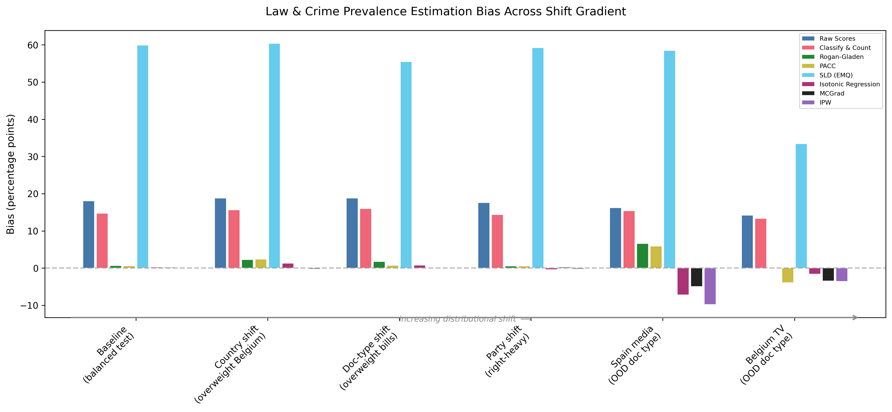

^1^Meta, ^2^The London School of Economics and Political Science

## Significance

Researchers increasingly use AI systems, including large language models, as measurement devices to estimate how common a phenomenon is in a population. A critical but overlooked problem arises when the target population differs from the one on which the device was validated: standard calibration methods produce biased prevalence estimates. Because prevalence estimates inform policy decisions, scientific conclusions, and resource allocation, such bias can have serious downstream consequences. We show that multicalibration (requiring a device to be accurate not just on average but conditional on the input features) is sufficient for unbiased prevalence estimation under covariate shift, and that no standard calibration method provides this guarantee. Our result, established theoretically and confirmed by simulation and empirical applications, implies that measurement in general and the rapidly growing body of research using AI for measurement specifically is vulnerable to systematic bias which could be mitigated by enforcing multicalibration.

## Abstract

Estimating the prevalence of a category in a population using imperfect measurement devices (diagnostic tests, classifiers, or large language models) is fundamental to science, public health, and platform governance. Standard approaches correct for known device error rates but assume these rates remain stable across populations. We show this assumption fails under covariate shift and that multicalibration, which enforces calibration conditional on the input features rather than just on average, is sufficient for unbiased prevalence estimation under such shift. Standard calibration and quantification methods fail to provide this guarantee. Our work connects recent theoretical work on fairness to a longstanding measurement problem spanning nearly all academic disciplines. A simulation confirms that standard methods exhibit bias growing with shift magnitude, while a multicalibrated estimator maintains near-zero bias. Two empirical applications---estimating employment prevalence across U.S. states using the American Community Survey, and classifying political texts across four countries using an LLM---demonstrate that multicalibration substantially reduces bias in practice, while highlighting that calibration data should cover the key feature dimensions along which target populations may differ.

# Introduction

Large language models (LLMs) are increasingly used as measurement devices for estimating the prevalence of a category in a population. Researchers now routinely deploy LLMs as zero-shot classifiers to estimate the frequency of phenomena that previously required expensive manual annotation: coding democracy indicators across countries [@weidmann2025democracy], classifying protest events in news corpora [@overos2024protest], estimating party policy positions from manifestos across dozens of countries and languages [@benoit2026llm], categorizing open-ended survey responses at near-human accuracy [@mellon2024survey; @gilardi2023chatgpt], extracting diagnostic attributes from pathology reports [@sushil2024clinical], identifying goals-of-care discussions in clinical notes [@sibley2025goc], annotating art forms in auction records [@tojima2025art], and converting qualitative text into quantitative variables across multiple languages [@karjus2025mixed]. LLMs are also being deployed for content moderation^[<https://openai.com/index/using-gpt-4-for-content-moderation/>] and as LLM "judges" to assess the quality and safety of AI systems [@zheng2023judging; @yuan2024selfrewarding].

These applications are typically validated by reporting discriminative performance: accuracy, AUC, or agreement with human annotations. Researchers then use or advocate for using validated LLMs as measurement devices across new populations, time periods, or subgroups. But strong discriminative performance does not guarantee accurate prevalence estimates. When the composition of the target population differs from the validation population, a model that separates positives from negatives well can still produce prevalence estimates that are substantially biased, because discrimination is invariant to the calibration errors that drive prevalence bias. This problem is invisible to standard validation practice and, as we show, can produce large bias even with strong classification performance.

Neither the confidence elicitation literature nor the quantification^[The task of estimating prevalence from imperfect classifiers is known as *quantification* in the machine learning literature; we use this term interchangeably with *prevalence estimation*.] literature solves this problem. Confidence elicitation methods — verbalized confidence [@tian2023verbalized], token log-probabilities [@kadavath2022language], consistency sampling [@wang2023selfconsistency] — and post-hoc calibration [@oliveira2025calibration] can improve the quality of an LLM's scores, but they target *global* calibration: calibration on the population where they are evaluated. Empirical evidence confirms that such calibration does not transfer: it degrades 2--3$\times$ under language shift even when accuracy is preserved [@yang2023calibration], and varies widely across tasks and domains [@ren2025predicting]. Quantification methods such as "Classify & Count", "Adjusted Count", and the Saerens-Latinne-Decaestecker EM algorithm (see @gonzalez2017review for a detailed survey) attempt to correct for classifier errors directly, but rely on the assumption that error properties remain static across populations. Importance-weighted methods handle covariate shift in principle but require re-estimating density ratios for each new target population. None of these approaches provides a measurement device that can be validated once and then reliably applied to new populations.

We show that multicalibration — calibration conditional on the input features, not just on average — fills this gap. Building on @kim2022universal's "Universal Adaptability" result, we show that a multicalibrated device requires no target-specific estimation: it is calibrated once on source data and produces unbiased prevalence estimates on any target population whose features lie within the calibration support. This property is critical for LLM-based measurement, where a single device is typically applied to many populations without the opportunity to re-calibrate for each one. Importantly, multicalibration can be applied to any LLM output — from discrete Yes/No classifications (the standard practice in applied research) to continuous confidence scores — because it operates on the scores' relationship to outcomes conditional on features, not on the scores' intrinsic quality. Our results apply more generally to any model-based measurement device, but the LLM setting is where the practical need is most acute and the calibration problem most overlooked.

We review existing approaches to the quantification problem, connect the quantification task to the broader theory of domain adaptation via multicalibration, and apply those insights to two empirical applications: a controlled demonstration using a standard ML classifier to estimate employment prevalence under age distribution shift (American Community Survey), followed by the main application of classifying political texts across four countries using an LLM as a zero-shot measurement device.

# Results

## Standard calibration methods fail under covariate shift

Consider a binary outcome $Y \in \{0, 1\}$, features $X$, and a device $h(X) \in [0,1]$ producing probabilistic predictions. The goal is to estimate the population prevalence $\pi = P(Y=1)$ in a target population using only unlabeled target data $\{X_i\}$ and the device $h$. The key assumption concerns which aspect of the data-generating process changes across populations. Three types of distributional change are commonly distinguished [@storkey2009dataset]:

- **Covariate shift**: The marginal distribution of features $P(X)$ changes, but the conditional $P(Y \mid X)$ remains stable. This is natural when features causally influence outcomes ($X \to Y$): applying a device to a new population changes the mix of features but not the underlying feature-outcome relationships. Many measurement applications fit this pattern: demographics influence employment, text content determines topic relevance, patient characteristics drive diagnoses. However, some settings are better described by $Y \to X$ (for example, fraudulent intent may drive user behavior on a platform), in which case label shift is the more appropriate assumption.
- **Label shift** (prior probability shift): The prevalence $P(Y)$ changes, and the conditional $P(X \mid Y)$ remains stable. This is natural when outcomes generate features ($Y \to X$), as in some diagnostic settings where a disease produces symptoms. However, for most measurement tasks where the goal is to classify based on observed features, the $X \to Y$ direction is more appropriate.
- **Concept drift**: The conditional $P(Y \mid X)$ changes, not as a consequence of shifting $P(X)$ or $P(Y)$, but because the mechanism linking features to outcomes itself changes. For example, the meaning of words may evolve over time, or a disease may mutate to present differently. No purely statistical post-processing can correct for concept drift; new labeled data from the target distribution is required.

We focus on covariate shift, which is the dominant concern in the measurement settings motivating this paper (see Limitations for further discussion of concept drift).

A device is *globally calibrated* if $\mathbb{E}[Y \mid h(X) = p] = p$ for all prediction values $p$. Under global calibration, $\mathbb{E}[h(X)] = \mathbb{E}[Y] = \pi$, so the sample mean of predictions is an unbiased prevalence estimate. However, global calibration is a property of a *specific* population. A device calibrated on one population need not be calibrated on another, even under covariate shift with stable $P(Y \mid X)$.

The failure mechanism is straightforward. Suppose the population consists of subgroups $G$ with weights $w_G$. Within each subgroup, the device may be biased: let $\epsilon_G = \mathbb{E}[Y - h(X) \mid X \in G]$ denote the mean prediction error within group $G$. Global calibration requires only that these errors cancel on average: $\sum_G w_G \epsilon_G = 0$. Under covariate shift, the group weights change to $w_G^*$, and the bias in the prevalence estimate becomes $\sum_G w_G^* \epsilon_G$, which is generally nonzero unless $\epsilon_G = 0$ for all $G$. Crucially, a device can be perfectly globally calibrated, with errors that precisely cancel in the training population, while having nonzero mean prediction error within every individual subgroup.

The quantification literature has proposed several methods to correct for device errors [@gonzalez2017review]. Each is vulnerable to the failure mechanism described above. *Classify & Count* binarizes predictions at a threshold $\tau$ and reports the positive fraction; the threshold is chosen to match true prevalence on calibration data, but this correspondence breaks under shift. The *Adjusted Count* (Rogan-Gladen) estimator $\hat{\pi} = (\hat{p} - \text{FPR})/(\text{TPR} - \text{FPR})$ uses sensitivity and specificity from calibration data [@rogan1978estimating]. These error rates are weighted averages of group-specific rates; when group proportions shift, the learned rates no longer match the target population's. The ratio estimator further amplifies errors when $\text{TPR} - \text{FPR}$ is small. *Probabilistic Adjusted Classify & Count* (PACC) generalizes this to soft scores, using $\mathbb{E}[h(X) \mid Y\!=\!1]$ and $\mathbb{E}[h(X) \mid Y\!=\!0]$ in place of binary error rates, but fails for the same reason: these conditional means are weighted averages over subgroups and shift with population composition.

The *Saerens-Latinne-Decaestecker* (SLD) algorithm [@saerens2002adjusting], also known as EMQ, uses expectation-maximization to iteratively re-estimate prevalence by adjusting posteriors for a new prior; it is the strongest standard quantification method under label shift (where $P(X \mid Y)$ is stable), but under covariate shift, the class-conditional score distributions $P(h(X) \mid Y)$ change, causing SLD to converge to a biased estimate. The same argument applies to calibration approaches that assume stable error properties, such as the Calibrate-Extrapolate framework [@calibrateextrapolate2024]. Indeed, @calibrateextrapolate2024 explicitly demonstrate that "covariate shift does not imply a stable calibration curve": the calibrated posterior $P(Y\!=\!1 \mid h(X)\!=\!v)$ depends on the composition of individuals mapped to each score value $v$, which changes when $P(X)$ shifts. Their recommended estimator for the covariate-shift setting, averaging calibrated posteriors via isotonic regression, is precisely the global calibration baseline we evaluate below; as our results show, it still produces substantial bias because global calibration does not guarantee feature-conditional accuracy.

## Multicalibration guarantees unbiased prevalence estimation

The analysis above shows that all standard methods produce biased prevalence estimates under covariate shift, with bias $\sum_G w_G^* \epsilon_G$ that is generally nonzero unless every $\epsilon_G = 0$. The illustration used discrete groups for clarity, but the insight generalizes: what matters is that the device's predictions are correct *conditional on the features* $X$, not just on average.

Multicalibration [@hebertjohnson2018multicalibration] formalizes this requirement. A predictor $f(X)$ is *multicalibrated* with respect to a collection of subgroups $\mathcal{G}$ if $\mathbb{E}[Y \mid f(X) = v, X \in G] = v$ for every $G \in \mathcal{G}$ and prediction value $v$. When $\mathcal{G}$ is rich enough to capture all relevant structure in $X$, this is equivalent to requiring calibration conditional on the full feature space:

$$\mathbb{E}[Y \mid f(X) = v, X = x] = v$$

for all $x$ and $v$ with sufficient probability mass. This is the framing of @kim2022universal's "Universal Adaptability": a predictor calibrated conditional on $X$ yields correct expected values under any reweighting of $P(X)$, without requiring knowledge of the shift.

The connection to prevalence estimation is direct. If $f$ is calibrated conditional on $X$, then $\mathbb{E}[f(X) \mid X = x] = \mathbb{E}[Y \mid X = x]$ for all $x$. Under covariate shift, where only $P(X)$ changes while $P(Y \mid X)$ remains stable, the law of iterated expectations gives (where $\mathbb{E}^*$ and $P^*$ denote expectations and probabilities under the target distribution, and $\pi^* = P^*(Y\!=\!1)$ is the target prevalence):

$$\mathbb{E}^*[f(X)] = \int \mathbb{E}[f(X) \mid X = x] \, dP^*(x) = \int \mathbb{E}[Y \mid X = x] \, dP^*(x) = \mathbb{E}^*[Y] = \pi^*.$$

Because predictions are correct at each point in the feature space, the average of predictions tracks the true prevalence under *any* change in $P(X)$. Returning to the discrete illustration from the previous section: global calibration only ensures $\sum_G w_G \epsilon_G = 0$ for the training weights $w_G$; calibration conditional on $X$ ensures $\epsilon_G \approx 0$ everywhere, making the estimate robust to arbitrary changes in the feature distribution.

The condition that is strictly necessary for this robustness is *multi-accuracy*: $\mathbb{E}[f(X) - Y \mid X \in G] = 0$ for all groups $G$ that the shift can reweight. This requires only that the *mean* prediction equals the mean outcome within each subgroup, not that the full calibration curve is correct within each subgroup. Multicalibration, which additionally requires $\mathbb{E}[Y \mid f(X) = v, X \in G] = v$, is a strictly stronger condition that implies multi-accuracy. In practice, multicalibration is the preferable target for two reasons. First, practical algorithms like MCGrad naturally produce multicalibrated predictors, providing the stronger guarantee at no additional cost. Second, multicalibration protects against distribution shifts that are mediated by the scoring function itself. When the shift is a function of $f(X)$ (for example, when the device's scores are used to guide importance sampling for label collection, or when a downstream decision rule selects units with $f(X) > \tau$), the reweighting operates along the score axis rather than along features $X$, and multi-accuracy with respect to $X$ no longer suffices. Full calibration, $\mathbb{E}[Y \mid f(X) = v] = v$, is needed to correct for such score-dependent selection, and multicalibration provides this. Both conditions still require that the calibration features capture the dimensions along which the population shift occurs (an ignorability assumption); neither eliminates the need for thoughtful feature specification.

Practical post-hoc multicalibration algorithms can be applied to any base predictor, including LLMs and black-box classifiers, by iteratively correcting predictions in regions of the feature space where they are miscalibrated [@hebertjohnson2018multicalibration; @gopalan2022omnipredictors]. Early algorithms required discrete groups to be specified explicitly, but more recent methods take a set of features as input and automatically discover miscalibrated regions, effectively approximating calibration conditional on the full feature space with increasing data [@tax2026mcgrad]^[An open-source implementation is available at <https://mcgrad.dev>.].

## Simulation: standard methods fail, multicalibration succeeds

We illustrate the theoretical results above with a simulation. We generate data with a binary covariate $X \in \{0,1\}$ and binary outcome $Y$, where $P(Y=1 \mid X=1) = 0.85$ and $P(Y=1 \mid X=0) = 0.15$. A classifier produces systematically biased predictions: 10% underestimation when $X=0$ and 10% overestimation when $X=1$. All calibration parameters are learned on a balanced training distribution ($P(X=0) = 0.5$). Prevalence is estimated by averaging the predicted probabilities over the target sample. We then evaluate prevalence estimates on test distributions where $P(X=0)$ ranges from 0.01 to 0.99, repeating 50 times (details in Materials and Methods).

{width=100%}

*Figure 1: Prevalence estimation under covariate shift for six methods across 50 simulation runs. The x-axis shows $\Delta P(X\!=\!0)$, the change in $P(X\!=\!0)$ from the training value of 0.5. (a) Average bias, defined as the relative error $100 \times (\hat{\pi} - \pi) / \pi$ (%), averaged over 50 runs. (b) Root mean squared error (RMSE). Only multicalibration maintains near-zero bias and RMSE across all levels of distribution shift.*

Figure 1 shows the results. At the training distribution (center), all methods except the uncalibrated baseline produce approximately unbiased estimates. As the distribution shifts, the methods diverge. Classify & Count and Rogan-Gladen show rapidly growing bias, exceeding $\pm40\%$ at extreme shifts. The Rogan-Gladen estimator is particularly unstable: its ratio structure amplifies estimation errors, producing bias that exceeds the other methods by an order of magnitude. SLD tracks the Rogan-Gladen curve closely; its EM procedure converges to a similarly biased estimate because the class-conditional score distributions, which SLD assumes are stable, shift under covariate shift.^[SLD's bias is non-monotonic in the magnitude of shift: it grows at moderate shifts but decreases slightly at the extremes. This occurs because SLD's output is bounded in $[0,1]$ (as a mean of adjusted posteriors), so it saturates at 0 or 1 under extreme shift, while the true prevalence asymptotes to 0.15 or 0.85. The gap between these limits is smaller than the gap at intermediate shifts where SLD has not yet saturated.] Global calibration shows more moderate but still substantial bias (up to $\pm15\%$). The RMSE panel (Figure 1b) shows that these bias differences dominate total estimation error: the RMSE curves closely track the absolute bias, confirming that variance is small relative to bias for all methods at this sample size. The multicalibrated estimator maintains near-zero bias and the lowest RMSE across the entire range of distribution shifts.

## Empirical application: employment prevalence under age distribution shift

Before applying multicalibration to LLM-generated scores, which present additional challenges such as coarse discretization and non-standard score distributions, we first demonstrate the core mechanism in a controlled setting with a standard ML classifier. We analyze data from the American Community Survey (ACS), a large-scale annual survey conducted by the U.S. Census Bureau. The concept to be measured is the rate of employment. The measurement device is a logistic regression model of binary employment status, with 16 sociodemographic features including age, education, marital status, disability status, and citizenship.

**Setup.** We train a logistic regression classifier on data from eight U.S. states (TX, MI, PA, OH, IL, GA, NC, VA) across 2016--2018, totaling approximately 1.5 million training observations. The remaining in-distribution data is split into a calibration set ($n \approx 644{,}000$) and a test set ($n \approx 920{,}000$). Six additional states (CA, NY, FL, WA, AZ, CO) are held out for out-of-distribution (OOD) evaluation. We fit two post-hoc calibration methods on the calibration set: isotonic regression (global calibration) and MCGrad, a multicalibration algorithm that enforces calibration conditional on both categorical and numerical features. We compare seven prevalence estimation methods: raw (uncalibrated) scores, Classify & Count with a prevalence-matched threshold, Rogan-Gladen adjustment, PACC, SLD, isotonic regression, and MCGrad.

**Age distribution shift.** Employment rates vary dramatically by age: approximately 47% for ages 16--24, 76% for ages 25--54, 61% for ages 55--64, and 17% for ages 65+. This makes age an ideal dimension along which to construct meaningful distribution shifts. We create synthetic target populations by resampling test data with shifted age distributions: young-skewed (oversampling ages 16--30), old-skewed (oversampling ages 60+), and bimodal (oversampling both tails). The resulting populations have true employment rates ranging from 12.8% to 46.0%. All calibration parameters are estimated once on the original calibration set and held fixed across scenarios.

{width=100%}

*Figure 2: Prevalence estimation bias (percentage points) under synthetic age distribution shift, for in-distribution data (left) and out-of-distribution states (right).*

| Setting | Age Dist.    | True Prev. | Raw   | CC    | RG      | PACC    | SLD     | IPW   | Iso.  | MCGrad |
|---------|--------------|------------|-------|-------|---------|---------|---------|-------|-------|--------|
| In-Dist | Original     | 46.0%      | -0.31 | -0.07 | +0.26   | -0.07   | +0.01   | -0.3  | -0.30 | -0.27  |
| In-Dist | Young-skewed | 12.8%      | +1.93 | +2.47 | -12.82  | -12.82  | -11.95  | -0.3  | +2.04 | -0.11  |
| In-Dist | Old-skewed   | 16.8%      | +7.23 | -6.62 | -16.77  | -16.77  | -16.76  | -1.2  | +6.65 | +0.22  |
| In-Dist | Bimodal      | 21.1%      | +4.57 | -1.50 | -18.62  | -19.97  | -16.14  | +4.7  | +4.33 | +0.12  |
| OOD     | Original     | 45.1%      | +1.15 | +1.40 | +2.12   | +2.13   | +2.25   | +1.7  | +1.17 | +1.35  |
| OOD     | Young-skewed | 13.0%      | +2.93 | +3.73 | -12.96  | -12.96  | -11.38  | +0.8  | +3.08 | +0.88  |
| OOD     | Old-skewed   | 16.0%      | +8.47 | -5.64 | -15.97  | -15.97  | -15.97  | +0.1  | +7.91 | +1.01  |
| OOD     | Bimodal      | 20.8%      | +5.91 | +0.09 | -16.14  | -17.27  | -15.20  | +6.3  | +5.69 | +1.13  |

*Table 1: Prevalence estimation bias in percentage points (pp) under synthetic age distribution shift. IPW = importance-weighted prevalence estimation (target-specific density ratio via logistic regression). RG = Rogan-Gladen, Iso. = Isotonic regression.*

**Results.** With no age shift, all methods produce approximately unbiased estimates (Table 1). Under shift, the methods diverge sharply.

Rogan-Gladen exhibits catastrophic failure, with bias of -12.8 to -18.6 percentage points in the in-distribution setting, effectively estimating zero or negative prevalence when the true rate is 13--21%. PACC and SLD show comparable bias (-12 to -20pp and -11 to -16pp respectively), confirming the theoretical prediction: all three methods rely on calibration quantities (binary error rates, conditional score means, or class-conditional score distributions) that shift with population composition. Isotonic regression and raw scores show more moderate but still substantial bias of 2--8 percentage points, reflecting the instability of global calibration curves under compositional change.

IPW, the standard covariate-shift baseline, performs well on simple shifts (young-skewed: -0.3pp, old-skewed: -1.2pp) but shows substantial bias on the bimodal shift (+4.7pp in-distribution, +6.3pp OOD). The bimodal shift creates a complex, non-monotonic density ratio that logistic regression does not capture well. IPW also requires re-estimating density ratios for each target population, unlike MCGrad which is fitted once.

MCGrad produces near-zero bias across all in-distribution age-shift scenarios ($\leq 0.27$pp), including the bimodal shift where IPW struggles. Because MCGrad is multicalibrated with respect to age and other features, its predictions are correct *conditional on* these covariates. When the age distribution shifts, the feature-conditional predictions remain valid, and their average tracks the true prevalence. Bootstrap resampling (200 iterations per scenario) confirms that MCGrad also achieves the lowest RMSE, indicating that the bias reduction does not come at the cost of increased variance.

In the OOD setting, where the model is applied to states never seen during training while also shifting the age distribution, MCGrad's advantage persists with modestly larger bias (0.88--1.35pp), reflecting the additional geographic shift along a dimension not included in the calibration features. IPW shows comparable OOD performance on simple shifts but again fails on the bimodal shift (+6.3pp).

## LLM-based topic classification under cross-national shift

The ACS application uses a standard ML classifier with well-distributed probability estimates. We now examine a more challenging and increasingly common setting: using an LLM as a zero-shot measurement device, where the score distribution is highly non-standard and the target populations span multiple countries and languages.

**Setup.** We use Llama 3.3 70B Instruct [@llama2024herd] (4-bit quantized) to classify political texts from the Comparative Agendas Project [@baumgartner2006cap] as related to Law & Crime (CAP major topic code 12). The data comprise 105,000 documents from six sub-populations across four countries and four languages: Danish parliamentary questions, Spanish oral questions, U.S. congressional bills, Belgian newspaper articles, Spanish media articles (El Pais and El Mundo), and Belgian TV news. LLM scores are extracted via verbalized confidence elicitation [@tian2023verbalized]: a two-stage dialogue first asks the model to classify the document (Yes/No), then asks it to estimate the probability that its answer is correct, with an instruction discouraging extreme certainty. The score is $h(X) = P(\text{correct})$ if the answer is Yes and $h(X) = 1 - P(\text{correct})$ if No. The classifier achieves strong discriminative performance across most sub-populations (AUC 0.869--0.959), with the exception of Danish parliamentary questions (AUC 0.738).

The calibration set draws equally from four sub-populations (Denmark questions, Spain questions, U.S. bills, Belgium newspaper; 10,000 each, 40,000 total), ensuring that all four countries and all four languages are represented. MCGrad is calibrated with categorical features (country, document type, party) and one numerical feature (decade).^[We also tested a richer feature set by adding 500 PCA components of the LLM's last-layer hidden states (8192-dim) as additional numerical segment features. The embedding features produced negligible changes in bias and RMSE across all scenarios, suggesting that the information they encode is largely redundant with the LLM's classification score. See SI Appendix for details.] Two sub-populations are held out as out-of-distribution targets: Spanish media (same country and language as calibration, but unseen document type) and Belgian TV news (same country and language as calibration, but unseen document type). This design mirrors a realistic deployment scenario: validating a measurement device on one document type and applying it to another within the same country. It isolates document type as the single novel dimension of shift.

**Score characteristics.** Unlike the ACS classifier, which produces well-distributed probability estimates, the LLM's verbalized confidence scores are coarsely discretized: the model gravitates toward round probability values, producing only 11 distinct score levels across 105,000 documents (Figure 3). Approximately 75% of scores fall in the mid-range [0.1, 0.9], with negligible mass at the boundaries. The verbalized scores are not calibrated posteriors: the mean score for negative documents ranges from 0.16 to 0.26 across sub-populations, producing substantial overestimation when averaged directly. SLD's EM algorithm, which assumes calibrated posteriors as input, diverges severely on these scores, converging to prevalence estimates of 33--60 percentage points above the true value.

{width=100%}

*Figure 3: LLM verbalized confidence score distribution by label across six CAP sub-populations. Scores are coarsely discretized (11 unique values) but well-distributed, with 75% in the mid-range [0.1, 0.9] and negligible boundary mass.*

**Results.** The shift gradient spans six scenarios (Table 2, Figure 4): a baseline with no shift, three within-calibration shifts (country composition, document type composition, party composition), and two OOD scenarios where document type is the single novel dimension.

| Scenario | Shift Type | True Prev. | Raw | CC | RG | PACC | SLD | IPW | Iso. | MCGrad |
|---|---|---|---|---|---|---|---|---|---|---|
| Baseline | None | 8.1% | +18.1 | +14.7 | +0.6 | +0.6 | +60.0 | +0.1 | +0.2 | +0.2 |
| Country shift | Within-cal. | 8.7% | +18.8 | +15.6 | +2.2 | +2.4 | +60.4 | -0.3 | +1.3 | +0.1 |
| Doc-type shift | Within-cal. | 6.5% | +18.8 | +16.0 | +1.7 | +0.7 | +55.5 | +0.0 | +0.8 | +0.1 |
| Party shift | Within-cal. | 9.0% | +17.6 | +14.4 | +0.6 | +0.6 | +59.2 | -0.3 | -0.4 | +0.2 |
| Spain media | OOD doc type | 19.3% | +16.2 | +15.4 | +6.6 | +5.9 | +58.5 | -9.8 | -7.2 | -4.9 |
| Belgium TV | OOD doc type | 11.1% | +14.2 | +13.3 | -0.0 | -3.9 | +33.4 | -3.5 | -1.6 | -3.4 |

*Table 2: Prevalence estimation bias (pp) for Law & Crime topic under cross-national and document-type shift. Methods are grouped by shift assumption: CC, RG, and PACC assume stable error rates; SLD assumes label shift ($P(h(X) \mid Y)$ stable); IPW estimates density ratios for the specific target (covariate shift, target-specific); Isotonic and MCGrad calibrate the device once on source data (covariate shift, target-independent). Bootstrap RMSE (200 iterations) closely tracks absolute bias. RG = Rogan-Gladen, Iso. = Isotonic regression, IPW = importance-weighted prevalence estimation.*

{width=100%}

*Figure 4: Prevalence estimation bias (pp) across the shift gradient. MCGrad achieves near-zero bias within the calibration distribution. On OOD populations (unseen document type), MCGrad's bias increases for both Belgian TV and Spanish media.*

The methods compared fall into three categories based on their shift assumptions. Classify & Count, Rogan-Gladen, and PACC assume stable error rates and perform no shift correction. SLD assumes label shift ($P(h(X) \mid Y)$ stable) and adjusts posteriors via EM. Importance-weighted prevalence estimation (IPW) and MCGrad both assume covariate shift ($P(Y \mid X)$ stable), but differ in a critical operational respect: IPW estimates the density ratio between source and target for each specific target population, while MCGrad calibrates the device once on source data and requires no target-specific estimation at deployment.

A notable finding is the severity of raw LLM score bias. Despite strong discriminative performance (AUC 0.869--0.959 across most sub-populations), simply averaging the LLM's verbalized confidence scores produces prevalence estimates biased by +14 to +19 percentage points, even at baseline with no distributional shift at all. The true Law & Crime prevalence is 8.1%, but the raw scores estimate approximately 26%. This disconnect between discrimination and calibration has immediate practical implications: researchers who validate an LLM classifier by reporting high AUC or accuracy, then estimate prevalence by averaging its scores over a corpus, will obtain grossly inflated estimates regardless of how well the model separates positive from negative documents. SLD, designed for label shift rather than the covariate shift present here, diverges catastrophically (+33 to +60pp).

Within the calibration distribution, MCGrad and IPW both achieve near-zero bias ($\leq 0.2$pp and $\leq 0.3$pp respectively), confirming that both covariate-shift methods work when the target's features are within the source support. Isotonic regression shows larger bias (0.4--1.3pp), consistent with the theoretical prediction that global calibration is insufficient under compositional change. The key difference between MCGrad and IPW is operational: MCGrad's calibration is fitted once and requires no target-specific computation, while IPW re-estimates density ratios for each new target.

On OOD populations, where document type is the single novel dimension, the methods diverge. For Spanish media (true prevalence 19.3%), IPW shows the largest bias among covariate-shift methods (-9.8pp), substantially worse than MCGrad (-4.9pp) and isotonic regression (-7.2pp). This occurs because IPW's density ratio estimation breaks down when the target contains feature values absent from the source (doc\_type='media' does not exist in the calibration set), a well-known positivity violation. MCGrad degrades more gracefully because its feature-conditional corrections, learned from Spanish parliamentary questions, partially transfer to Spanish media even though the document type is novel. For Belgian TV news (true prevalence 11.1%), IPW (-3.5pp) and MCGrad (-3.4pp) show similar bias, both underestimating prevalence.

**Comparison with the ACS application.** Across both applications, the pattern is consistent: MCGrad and IPW achieve comparable near-zero bias when the target population's features are represented in the calibration set. On OOD populations, MCGrad degrades more gracefully than IPW (ACS OOD states: $\leq 1.35$pp; CAP Spanish media: -4.9pp vs. IPW's -9.8pp). MCGrad's practical advantage is that it requires no target-specific estimation: a single calibrated device can be applied to any target population without re-fitting density ratio models. This is the "universal adaptability" property identified by @kim2022universal, and it is particularly valuable for measurement devices intended for deployment across many populations.

# Discussion

We have shown that multicalibration, calibration conditional on the input features rather than just on average, is sufficient for accurate model-based prevalence estimation under population shift. The minimal theoretical requirement is multi-accuracy (correct predictions on average within each subgroup), which multicalibration implies. Both conditions require that the calibration features capture the relevant dimensions of population shift, and both require that the target population's features lie within the support of the calibration distribution. Both empirical applications confirm this: when calibrated features overlap with the target population, MCGrad achieves near-zero bias; when the target introduces a novel feature value, bias increases with the severity of the shift. Practitioners should ensure their calibration data covers the key dimensions along which target populations may differ.

A central practical advantage of multicalibration over traditional covariate-shift methods is that it produces a *target-independent* measurement device. Importance-weighted methods achieve comparable within-calibration performance but require estimating density ratios for each new target population, and our CAP results show they fail more severely on OOD targets (IPW: -9.8pp on Spanish media, vs. MCGrad: -4.9pp) due to positivity violations when target features are outside the source support. A multicalibrated device, by contrast, is calibrated once and deployed without target-specific re-estimation. This is the "universal adaptability" property of @kim2022universal, and it is what makes multicalibration particularly well-suited to the measurement setting, where a single device is often applied to many target populations.

The practical implications are immediate. The growing use of LLMs as zero-shot measurement devices rests on the assumption that models validated on one population can be reliably applied to others. Our analysis shows this assumption is safe only when the model is multi-accurate---and ideally multicalibrated---with respect to features that may shift across populations. Without this, prevalence estimates in new populations, the primary use case for LLM-based measurement, are unreliable. Researchers using AI-based measurement should treat multicalibration not as an optional fairness criterion, but as a practical tool for ensuring valid inference.

This result also clarifies why certain widely-used practices are inadequate. The common approach of reporting a model's overall accuracy, F1, or AUC on a held-out set provides no information about calibration, let alone multicalibration. A model with 95% accuracy can still produce heavily biased prevalence estimates if its errors are unevenly distributed across the feature space. Similarly, reporting a single calibration curve, as is standard in the quantification literature [@gonzalez2017review]---certifies only global calibration, which we have shown is insufficient under shift. Even comprehensive methodology textbooks for text-as-data research devote extensive attention to classification accuracy and validation but do not discuss calibration as a requirement for valid prevalence estimates [@grimmer2022text]; multicalibration is entirely absent from these discussions.

**Applying multicalibration to LLM-based measurement.** Multicalibration does not require access to a model's internals. When LLMs classify documents, survey responses, or clinical notes, observable metadata such as document source, author demographics, text length, and language can serve directly as segment features, and these often correspond to the dimensions along which population composition may shift. For richer feature structure, @detommaso2024mcllm demonstrate two approaches for constructing features over prompt-completion pairs: clustering within the embedding space and "self-annotation" via yes/no questions about input properties. Both yield features enabling effective multicalibration of LLM confidence scores, though end-to-end pipelines for LLM-based prevalence estimation remain an active area of development.

Several limitations warrant discussion. First, multicalibration requires specifying the features over which to calibrate; the guarantee holds only for shifts along included dimensions. As the CAP application demonstrates, performance degrades when target populations introduce novel feature values, particularly when compounded by a large prevalence difference. Practitioners should ensure calibration data covers the range of feature values likely to appear in target populations. Second, multicalibration requires labeled calibration data of sufficient size. This is feasible for standard ML pipelines but more challenging for zero-shot LLM settings, where calibration labels may require the manual annotation LLMs were intended to avoid; prediction-powered inference [@angelopoulos2023ppi] offers a complementary framework. Third, LLMs produce text rather than probability scores; calibratable scores can be obtained via token log-probabilities, verbalized confidence elicitation [@tian2023verbalized] (as used in our CAP application), or repeated sampling [@detommaso2024mcllm]. Fourth, our framework assumes covariate shift ($P(Y \mid X)$ stable). In settings where the causal direction is $Y \to X$ (such as fraud detection, where intent drives observable behavior), label shift may be a more appropriate assumption, and methods like SLD that are designed for label shift may be preferable. Under concept drift, no purely statistical correction substitutes for new labeled data. Finally, both applications use settings where ground-truth labels enable direct bias measurement---synthetic shifts in the ACS case and expert-coded labels across countries in the CAP case.

These results connect two literatures that have developed in isolation. The quantification literature has focused on correcting aggregate error rates but has not engaged with feature-conditional calibration [@gonzalez2017review; @calibrateextrapolate2024]. The multicalibration literature has focused on individual-level prediction quality and fairness but has not emphasized the implications for population-level inference [@hebertjohnson2018multicalibration; @kim2022universal]. Our contribution is to show that calibration conditional on the feature space is the missing link that makes model-based prevalence estimation reliable under the distribution shifts that motivate its use.

# Materials and Methods

**Simulation.** We generate $n = 10{,}000$ observations with a binary covariate $X \in \{0,1\}$ and outcome $Y \sim \text{Bernoulli}(P(Y \mid X))$, where $P(Y=1 \mid X=1) = 0.85$ and $P(Y=1 \mid X=0) = 0.15$. The classifier produces deterministic scores $\hat{p}(X=0) = 0.135$ and $\hat{p}(X=1) = 0.935$, representing 10% multiplicative bias within each stratum. For each of $B = 50$ iterations, we generate fresh calibration data from $P(X=0) = 0.5$, estimate all method-specific parameters, then evaluate bias and mean squared error on 20 test distributions with $P(X=0)$ ranging from 0.01 to 0.99. The seven methods compared (uncalibrated averaging, Classify & Count with a prevalence-matched threshold, Rogan-Gladen adjustment, PACC, SLD/EMQ, global multiplicative calibration, and multicalibration with stratum-specific additive corrections) are detailed with full mathematical definitions in the SI Appendix.

**Empirical application (ACS).** We use the ACS Public Use Microdata Sample via the *folktables* package, with the ACSEmployment prediction task (binary: employed vs. not employed) and 16 sociodemographic features. Training data comprises eight states (TX, MI, PA, OH, IL, GA, NC, VA) across 2016--2018. The base model is logistic regression with standard scaling. Post-hoc calibration uses isotonic regression (global) and MCGrad (multicalibration with categorical and numerical segment features) on a held-out calibration set ($n \approx 644{,}000$). In addition to raw scores, Classify & Count, Rogan-Gladen, isotonic regression, and MCGrad, we include two methods from the quantification literature: PACC (Probabilistic Adjusted Classify & Count), which generalizes Rogan-Gladen to continuous scores [@gonzalez2017review], and SLD (Saerens-Latinne-Decaestecker), an EM algorithm that iteratively adjusts posteriors for a new prior [@saerens2002adjusting]. Synthetic age-shifted populations are created by importance-weighted resampling of the test set ($n \approx 920{,}000$), with exponential weights favoring young ages, old ages, or both extremes. RMSE is computed via bootstrap resampling (200 iterations per scenario). Six additional states (CA, NY, FL, WA, AZ, CO) serve as OOD evaluation data.

**Empirical application (CAP).** We use data from the Comparative Agendas Project [@baumgartner2006cap], which provides expert-coded policy topic labels for political texts across countries. The binary outcome is whether a document addresses Law & Crime (CAP major topic code 12). We sample 105,000 documents: 15,000 from each of six sub-populations (Danish parliamentary questions, Spanish oral questions, U.S. congressional bills, Belgian TV news, Belgian newspaper articles) and 30,000 from Spanish media (El Pais and El Mundo combined). The measurement device is Llama 3.3 70B Instruct [@llama2024herd], run with 4-bit NF4 quantization on a single A100 80GB GPU. Scores are extracted via verbalized confidence elicitation [@tian2023verbalized]: a two-stage dialogue first prompts the model with the CAP codebook definition of Law & Crime and asks for a Yes/No classification, then asks the model to estimate the probability that its answer is correct, with an anti-certainty instruction to discourage degenerate 0/1 outputs. The score is $P(\text{correct})$ if the answer is Yes and $1 - P(\text{correct})$ if No. This produces scores in [0.01, 0.99] with no boundary mass, so no preprocessing (such as score squashing) is required before applying MCGrad's logit transform. The calibration set ($n \approx 40{,}000$) draws equally from four sub-populations (Denmark questions, Spain questions, U.S. bills, and Belgium newspaper), ensuring that all four countries and all four languages are represented. MCGrad is calibrated with categorical features (country, document type, political party) and one numerical feature (decade). Isotonic regression is fitted on the same calibration set. The threshold for Classify & Count and Rogan-Gladen is set via Youden's J statistic (maximizing TPR $-$ FPR on the calibration set).^[The simulation and ACS application use prevalence-matching thresholds (choosing $\tau$ so that the positive fraction on calibration data equals the true prevalence). For the CAP application, Youden's J provides a more reasonable operating point.] PACC parameters ($\mathbb{E}[h(X) \mid Y\!=\!1]$ and $\mathbb{E}[h(X) \mid Y\!=\!0]$) and SLD's source prevalence are estimated on the calibration set. Bootstrap RMSE uses 200 iterations per scenario. Two sub-populations are held out as out-of-distribution targets: Spanish media and Belgian TV news, which differ from the calibration data only in document type (media articles and TV news vs. parliamentary questions, bills, and newspaper articles), while sharing the same countries and languages seen during calibration.

**Software.** MCGrad is available at github.com/facebookincubator/MCGrad. Simulation and analysis code are available at [TODO: insert repository URL before submission].

## Author Contributions

[TODO: Add author contributions, e.g., "A.B. designed research; C.D. performed research; E.F. contributed analytic tools; A.B. and C.D. analyzed data; and A.B. wrote the paper."]

## Competing Interests

The authors declare no competing interests.

## Data Availability

The American Community Survey data are publicly available via the *folktables* package. The Comparative Agendas Project data are publicly available at <https://www.comparativeagendas.net>. Simulation and analysis code are available at [TODO: insert repository URL].

## Keywords

multicalibration, prevalence estimation, covariate shift, large language models, quantification

# References
