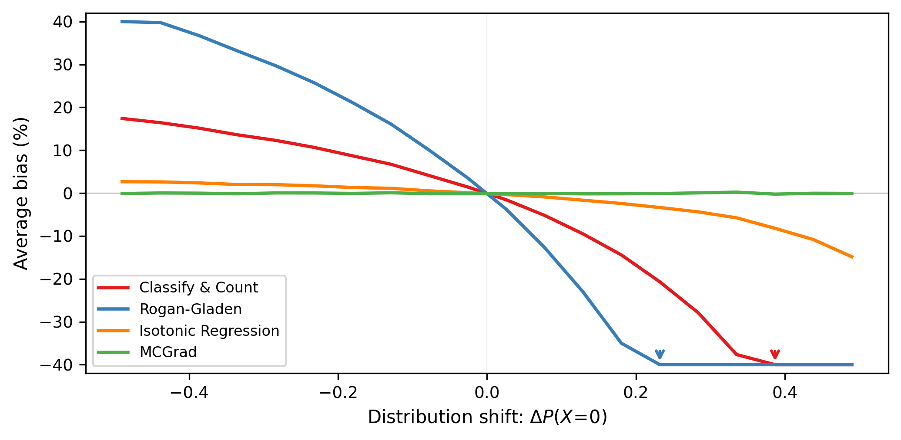
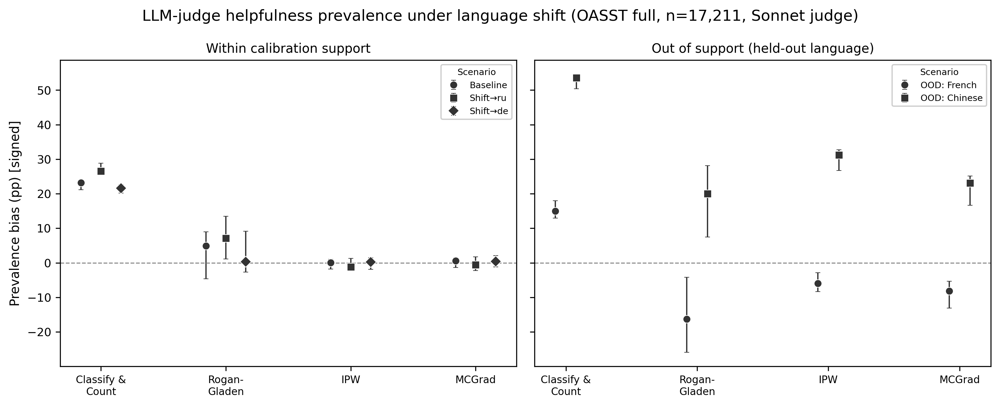
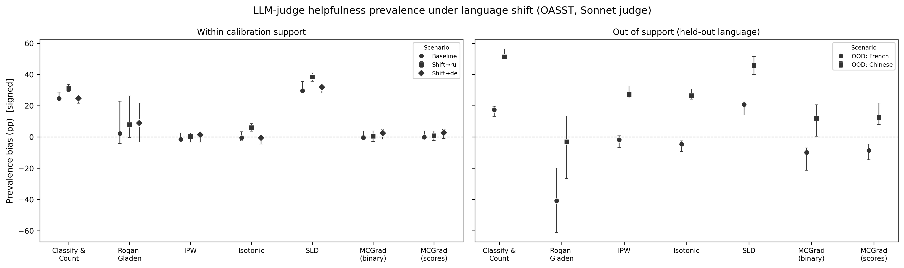

^1^Meta Platforms Inc., ^2^The London School of Economics and Political Science

**Corresponding author:** Fridolin Linder (flinder@meta.com)

**Keywords:** LLM-as-judge | model evaluation | quantification | calibration | multicalibration | distribution shift

## Abstract

Large language models are increasingly evaluated by other language models: an *LLM judge* scores responses for correctness, helpfulness, or safety, and the reported quantities (pass rates, win rates, violation rates) are *aggregates* over those scores. Because judges are imperfect, a growing literature debiases the aggregate with an estimated sensitivity/specificity correction (Rogan--Gladen). This correction, and its confidence-elicitation and post-hoc-calibration alternatives, assume an invariance that fails in the regime where judges are actually deployed: when the judged population changes (a new model, task mix, or language), the judge's error rates change with it, and the corrected aggregate becomes biased and unstable. We show that *multicalibration* (calibration conditional on input features) is sufficient for unbiased aggregates under any covariate shift along the calibrated features, so a judge is calibrated once and reused on any in-support target with no per-target re-estimation. On a controlled benchmark with exact ground truth (American Community Survey employment) and a large LLM-judge study (Claude Sonnet grading the helpfulness of 17,211 OpenAssistant responses across six languages), the globally corrected judge is biased by 4--53 percentage points with confidence intervals several times wider, while the multicalibrated estimator stays near-unbiased in support and degrades gracefully out of it. Because the correction works on the bare Yes/No labels practitioners already collect, the gain comes from calibration design, not confidence elicitation. High judge agreement (AUC) is neither necessary nor sufficient; feature-conditional calibration is what makes LLM-based evaluation transport across distributions.

# Introduction

Evaluating language models at scale increasingly means using a language model to do the evaluating. An *LLM judge* reads a model's output and scores it (correct, helpful, or safe), and these per-response judgments are aggregated into the statistics that decide which model ships: pass rates, win rates, unsafe-response fractions [@zheng2023judging; @yuan2024selfrewarding; @lambert2024rewardbench]. Judges are attractive because the properties they estimate (helpfulness, factuality, safety, instruction-following) are expensive or impossible to verify programmatically, so one cheap grader is applied across many models, tasks, and deployments.

The quantity of interest is almost never the label on a single response but the *aggregate*: a class proportion in a population. In the quantification literature these are *prevalence estimation* problems [@gonzalez2017review; @hopkinsking2010nonparametric], recovering a proportion from an imperfect classifier, here the judge.

Judges are usually validated by their agreement with human labels: accuracy, $F_1$, AUC, or Cohen's $\kappa$ on a meta-evaluation set [@zheng2023judging; @lambert2024rewardbench]. A judge that clears a bar is deployed to new models and tasks. A more careful recent literature notes that agreement is not enough for a *number*: with imperfect sensitivity and specificity, the raw positive fraction is a biased estimate of the true rate. The recommended fix is a plug-in Rogan--Gladen adjustment [@rogan1978estimating]: estimate the judge's true- and false-positive rates on a labeled set, invert to debias the reported rate, and propagate calibration uncertainty into the intervals [@lee2026correctly; @fiedler2026bias].

We argue this corrects the wrong problem. Rogan--Gladen and its relatives assume the judge's *conditional error behavior is invariant* between the calibration and target populations: one pair of sensitivity/specificity numbers transfers wherever the judge is applied. This is a label-shift invariance: it lets $P(Y{=}1)$ change but holds the judge's error rates given the truth fixed. Deployment is the opposite regime. A judge calibrated on one distribution of responses is applied to a *shifted* one (a new model with a different output style, a harder task mix, another language, longer answers), and under such *covariate shift* the error rates are not constants: they depend on the features being judged, so a fixed-rate correction is biased. Worse, a lenient judge (as we find LLM judges often are) gives Rogan--Gladen a small denominator, and its variance explodes, so even an acceptable-looking point estimate is unusable.

The property that makes an aggregate transport is *multicalibration*: calibration conditional on the input features, not merely on average [@hebertjohnson2018multicalibration]. The relevant guarantee is the "universal adaptability" of @kim2022universal: a predictor that is multi-accurate over a class of feature-defined groups yields unbiased target means under *any* reweighting captured by those groups, with no knowledge of the shift and no target-specific estimation. We turn this into a protocol: calibrate a judge once, conditioning on observable metadata (model, task, language, length) and the judge's own output, then read off an unbiased aggregate on any target within the calibration support. It applies to any judge output, from the bare Yes/No labels that dominate practice to elicited confidence scores, because it operates on the judge-versus-truth relationship *conditional on features*, not on the intrinsic quality of the scores. We do not claim the underlying theorem; our contribution is (i) diagnosing that the covariate-shift regime, not the label-shift regime the Rogan--Gladen family assumes, governs LLM-judge evaluation, and (ii) showing empirically that feature-conditional calibration fixes it, works on bare labels, and owes its gain to calibration design rather than confidence elicitation.

Three findings anchor the paper. First, on a large LLM-judge study (Claude Sonnet judging the helpfulness of 17,211 OpenAssistant responses across six languages, graded against human labels), a globally corrected judge (Rogan--Gladen) is biased by several points and carries confidence intervals four to seven times wider than the multicalibrated estimator, and its bias grows as the language mix shifts; multicalibration stays within a point of the truth with tight intervals. Second, the correction works on the judge's bare Yes/No labels, matching what it achieves on elicited $P(\text{helpful})$ scores: the gain comes from conditioning on features, not from eliciting confidences. Third, judge agreement is not the right target: our judge's scores discriminate human labels only weakly (AUC $0.65$), yet multicalibration still yields near-zero aggregate bias, because prevalence accuracy is governed by calibration rather than by how well the judge ranks responses. A controlled benchmark with exact ground truth (American Community Survey employment) and a simulation confirm the mechanism, and show it is classifier-agnostic.

# Background and related work

**LLM-as-judge and the reporting problem.** Using one model to evaluate another is now routine, from MT-Bench and Chatbot-Arena-style preference judging [@zheng2023judging] to self-rewarding training loops [@yuan2024selfrewarding] and reward-model benchmarks [@lambert2024rewardbench]. The reliability of judges themselves is increasingly scrutinized, and a recent line of work targets the specific problem we study: reporting an unbiased *aggregate* from an imperfect judge. @lee2026correctly and @fiedler2026bias correct the raw judged rate with a Rogan--Gladen adjustment [@rogan1978estimating] using judge sensitivity/specificity estimated on a labeled set, and construct confidence intervals; @lee2026correctly show unbiasedness under shift in the true-label distribution, i.e., $P(Y)$ may differ between calibration and test while $P(\hat Y \mid Y)$ is held fixed. @landesberg2026causal calibrate judge scores to oracle labels via isotonic regression and audit transport per target. @li2026calibrate study calibrated aggregation across a panel of judges. These methods share the invariance we challenge: the judge's conditional error behavior is treated as stable across populations, which is the appropriate model under label shift but not under the covariate shift that dominates deployment. We take these as the baselines to beat and show where and why they fail.

**Quantification.** Estimating a class proportion from imperfect predictions is *quantification* in machine learning [@gonzalez2017review] and the target of ReadMe [@hopkinsking2010nonparametric] and its successor [@jerzakkingstrezhnev2023improved]. Classical quantifiers assume *label shift*, in which $P(X \mid Y)$ is stable while the prior $P(Y)$ may move: Adjusted Count, the Saerens--Latinne--Decaestecker (SLD/EMQ) algorithm [@saerens2002adjusting], and distribution-matching methods such as DyS and HDy [@maletzke2018quantification]. That is the right model when the label causes the features. When a judge scores a response, the features (model, task, language, content, length) drive the outcome, so $P(Y \mid X)$ is stable and $P(X)$ shifts. Under this covariate shift, label-shift quantifiers are not guaranteed unbiased, as our results confirm.

**Using imperfect labels for valid inference.** A complementary literature debiases a downstream estimate computed from cheap machine labels using a small gold sample drawn *from the target*: design-based supervised learning [@egami2023dsl] and prediction-powered inference [@angelopoulos2023prediction]. These are assumption-light (no covariate-shift or ignorability condition) but *target-specific* by construction: each new population needs its own gold sample. That is the per-target cost that evaluation-at-scale, applying one judge to many models and tasks, is trying to avoid. We treat these as complementary and return to the trade-off in the discussion.

**Calibration and its non-transfer.** Calibration (predicted probabilities matching empirical frequencies) is the property that links a probabilistic scorer to an unbiased aggregate: a globally calibrated device has mean score equal to the population prevalence. But global calibration is a property of *one* population and need not survive a shift. LLM calibration degrades two- to three-fold under language shift even when accuracy is preserved [@yang2023calibration] and varies widely across tasks [@ren2025predicting]. Confidence-elicitation methods (verbalized confidence [@tian2023verbalized], token log-probabilities [@kadavath2022language], self-consistency [@wang2023selfconsistency]) and post-hoc recalibration [@oliveira2025calibration] target *global* calibration and inherit this non-transfer. Multicalibration [@hebertjohnson2018multicalibration; @detommaso2024mcllm] conditions on features and is therefore stable under reweighting of those features; @detommaso2024mcllm apply it to per-response LLM confidence scoring (hallucination detection), a per-instance objective distinct from the population-level aggregate we target. This is the property we exploit for aggregate evaluation.

# Setup: aggregate estimation from an imperfect judge

Let $Y\in\{0,1\}$ be the property of interest (e.g., a response is helpful, correct, or safe), $X$ the observable features of the item being judged (model, task, language, length, content), and $h(X)\in[0,1]$ the judge, which may emit a hard label in $\{0,1\}$ or a score. The estimand is the aggregate $\pi^*=P^*(Y{=}1)$ in a target population (a pass rate, helpfulness rate, or violation rate), to be estimated from unlabeled target items $\{X_i\}$ and the judge, using a labeled *calibration* set drawn from a source population.

We assume *covariate shift* [@storkey2009dataset]: $P(X)$ differs between calibration and target while $P(Y\mid X)$ is stable. The substantive content of this assumption is that the judge's mapping from an item's features to its true label is stable across populations, while the mix of items being judged changes. It is the exact complement of the label-shift invariance that the Rogan--Gladen family assumes, which instead holds $P(X\mid Y)$ fixed, i.e., that items of a given class share the same features across populations, an invariance that fails when a new model, task mix, or language changes how the judged items look. (The heuristic linking stable $P(Y\mid X)$ to features causing the outcome, and stable $P(X\mid Y)$ to the outcome causing the features, traces to @scholkopf2012causal; we rely on the invariance, not on the causal direction.) Label shift and concept drift are discussed under limitations.

# Why global corrections fail and multicalibration suffices

**Global calibration is population-specific.** A judge is *globally calibrated* on a population if $\mathbb{E}[Y \mid h(X){=}p]=p$ for all $p$; then $\mathbb{E}[h(X)]=\pi$ and averaging scores estimates the aggregate without bias. But calibration on one population need not hold on another. Partition the population into feature-defined groups $G$ with weights $w_G$, and let $\epsilon_G=\mathbb{E}[h(X)-Y\mid X\in G]$ be the judge's mean signed error in group $G$. Global calibration requires only that these errors cancel *on average*: $\sum_G w_G\epsilon_G=0$. Under covariate shift the weights become $w_G^*$, and the aggregate bias is
$$\hat{\pi}^*-\pi^*=\sum_G w_G^*\,\epsilon_G,$$
nonzero in general unless every $\epsilon_G=0$. A judge can be perfectly calibrated on the meta-evaluation set (its group errors offsetting under $w_G$) and badly biased on a new model or task that reweights those groups. High agreement offers no protection: AUC depends only on the ranking of scores and is invariant to all miscalibration, including the feature-conditional errors $\epsilon_G$ that drive aggregate bias under shift.

Every global correction inherits this mechanism. Classify \& Count (report the fraction the judge labels positive) and the Rogan--Gladen adjustment rely on error rates estimated on the calibration set; those rates are weighted averages over groups and change with target composition. The Rogan--Gladen estimate $\hat\pi_{\mathrm{RG}}=(\hat p-\widehat{\mathrm{FPR}})/(\widehat{\mathrm{TPR}}-\widehat{\mathrm{FPR}})$ is additionally *unstable*: when the judge is lenient, $\mathrm{TPR}-\mathrm{FPR}$ is small and its ratio form amplifies both bias and variance. SLD/EMQ [@saerens2002adjusting] and distribution-matching quantifiers assume label shift and fail under covariate shift. Global recalibration by isotonic regression removes average miscalibration but not the group-specific $\epsilon_G$ [@calibrateextrapolate2024].

**Feature-conditional calibration removes the bias.** The fix is to drive every $\epsilon_G$ to zero, not merely their weighted sum. A predictor $f$ is *multicalibrated* with respect to a group class $\mathcal{G}$ if $\mathbb{E}[Y\mid f(X){=}v,\,X\in G]=v$ for all $G\in\mathcal{G}$ and values $v$ [@hebertjohnson2018multicalibration]. The condition strictly needed for unbiased aggregates under every reweighting along $\mathcal{G}$ is the weaker *multi-accuracy*, $\mathbb{E}[f(X)-Y\mid X\in G]=0$ for all $G\in\mathcal{G}$. Its consequence is the @kim2022universal universal-adaptability guarantee: if $f$ is multi-accurate with respect to $\mathcal{G}$, then for any target whose density ratio $dP^*/dP$ is measurable with respect to $\mathcal{G}$,
$$\mathbb{E}^*[f(X)]=\mathbb{E}\!\left[\tfrac{dP^*}{dP}(X)\,f(X)\right]=\mathbb{E}\!\left[\tfrac{dP^*}{dP}(X)\,Y\right]=\mathbb{E}^*[Y]=\pi^*.$$
One judge, calibrated once on source data, is thus unbiased on every target whose shift lies along the calibrated feature dimensions and within support: no knowledge of the shift, no target-specific estimation.

**Why multicalibration rather than multi-accuracy.** Multi-accuracy is the minimal sufficient condition, but multicalibration is the better practical target. Post-hoc algorithms produce it at no extra cost (we use MCGrad [@tax2026mcgrad], which fits residual structure by gradient boosting in logit space), and it extends the guarantee to score-mediated shifts (e.g., selecting which items to human-audit by judge score, or reporting the aggregate within score strata) and provides robustness to misspecifying which features drive the shift [@gopalan2022omnipredictors].

**The scope condition.** The guarantee rests on two requirements. *Support/overlap*: the target's feature values must lie within the calibration support. *Expressiveness*: the class $\mathcal{G}$ must be rich enough that within-cell $P(Y\mid X)$ is stable across populations: the features must capture every dimension along which the shift interacts with the outcome (an ignorability assumption). The support condition is the analogue of the positivity that importance weighting needs; the expressiveness condition is discharged once, at calibration time, rather than re-estimated per target. When either fails (a novel feature value, or latent variation no feature captures), estimates degrade, as our out-of-support results show.

# Simulation

We first illustrate the mechanism in a setting simple enough to verify by hand. Data have a binary covariate $X\in\{0,1\}$ and outcome $Y$ with $P(Y{=}1\mid X{=}1)=0.85$, $P(Y{=}1\mid X{=}0)=0.15$. A judge produces deterministic, systematically biased scores (a 10\% multiplicative error within each stratum), wrong within each stratum but corrected to the true prevalence by a single global recalibration on the balanced training distribution $P(X{=}0)=0.5$. We estimate the aggregate on targets with $P(X{=}0)$ ranging from 0.01 to 0.99, holding all calibration parameters fixed, over 50 replications.

{width=90%}

*Figure 1. Relative aggregate bias under covariate shift (50 runs). The x-axis is the change in $P(X{=}0)$ from the training value of 0.5. Classify \& Count and Rogan--Gladen diverge with shift; global recalibration shows moderate bias; the multicalibrated estimator stays near zero. Cropped at $\pm40\%$; full range and additional methods in the appendix.*

At the training distribution all methods are approximately unbiased (Figure 1). As the target shifts they diverge: Rogan--Gladen is most unstable, its ratio form amplifying error beyond $\pm40\%$; Classify \& Count grows in the same direction; global recalibration shows moderate but nonzero bias; the multicalibrated estimator maintains near-zero bias and the lowest RMSE across the entire range.

# LLM-as-judge helpfulness under language shift

Our main study puts the argument in the setting that motivates it: an LLM judge deployed across a shifting population of responses, with human labels as ground truth. We use the OpenAssistant corpus [@kopf2023openassistant], which provides assistant responses annotated by multiple human reviewers for helpfulness. The estimand is the *helpfulness rate*, the fraction of responses in a target population that humans consider helpful. We binarize the human helpfulness score (mean of $\geq 3$ reviewers) at $0.6$ as the gold label, and take Claude Sonnet as the judge. The shift dimension is *language*: a judge calibrated on one language mix is applied to a different one, the direct analogue of a judge calibrated on today's models being applied to a new model, and the setting where LLM calibration is known to degrade sharply [@yang2023calibration].

**Design.** We sample 17,211 assistant responses across six languages (English, Spanish, Russian, German, French, Chinese). The human-gold helpfulness rate varies strongly by language, from 0.32 (Chinese) to 0.71 (German), so reweighting the language mix moves the target aggregate, which is the covariate-shift regime. We compare two judge output modes spanning current practice: a discrete Yes/No helpfulness label (the standard in applied use) and a directly elicited $P(\text{helpful})$ score. We calibrate on four languages (English, Spanish, Russian, German) and hold out two (French, Chinese) as out-of-support targets that share nothing with the calibration languages, a deliberately hard test. MCGrad conditions on observable metadata only: language, response length (log characters), and the judge's own label or score. We benchmark against Classify \& Count, Rogan--Gladen (the current judge-reporting recommendation, with a single global sensitivity/specificity), importance-weighting (IPW), isotonic regression, and SLD.

The judge is a realistic, imperfect instrument. It is systematically lenient (it labels 87\% of responses helpful against a 62\% gold rate), and its error rates vary by language: per-language sensitivity ranges 0.83--0.98 and specificity 0.07--0.36. Because error rates differ by language, a single global Rogan--Gladen correction *cannot* remain valid once the language mix moves; this is the premise of the experiment, confirmed in the data. The judge's elicited scores discriminate the human gold only weakly (AUC $0.65$): helpfulness is subjective, and the judge agrees with human reviewers far less than a topic classifier would. This makes the study a stress test of the central claim that *prevalence accuracy is a property of calibration, not discrimination*.

{width=100%}

*Figure 2. Aggregate helpfulness bias (signed percentage points, with 95\% bootstrap confidence intervals) for a Sonnet judge on 17,211 OpenAssistant responses. Left: within calibration support (baseline plus two language-mix shifts). Right: out of support (an entirely held-out language). Markers denote scenarios; bootstrap resamples the calibration set and refits. Classify \& Count is reliably biased; Rogan--Gladen is biased and high-variance; IPW and MCGrad are near-zero within support, with MCGrad requiring no per-target estimation.*

**Results (Figure 2, full scale).** Within support, the pattern is clear. Classify \& Count (the default of simply counting the judge's positive labels) is biased by $+22$ to $+27$pp across scenarios. Rogan--Gladen carries a $4$pp mean absolute bias whose confidence intervals are four to seven times wider than MCGrad's, and its bias *grows* as the mix shifts toward the language where the judge is most lenient (Russian: $+4.9 \to +7.1$pp). Its instability is intrinsic: the lenient judge gives $\mathrm{TPR}-\mathrm{FPR}\approx 0.13$, so the ratio correction amplifies calibration noise. IPW and MCGrad both achieve near-zero bias (mean $|{\cdot}|\leq 0.5$pp) with tight intervals ($\pm{\sim}1.5$pp). Out of support (a held-out language absent from calibration), every method degrades, as the scope condition predicts: Rogan--Gladen swings wildly ($-16$pp on French, $+20$pp on Chinese), and MCGrad is the most stable on average (OOD mean $|{\cdot}|$ $15.7$pp vs.\ IPW $18.6$, Rogan--Gladen $18.2$, Classify \& Count $34.3$) but is not immune: Chinese, with a 0.32 gold rate and very short responses, is hard for all methods.

**MCGrad versus IPW.** Within support, MCGrad and IPW tie on bias, as the theory predicts, since both rest on the same ignorability assumption and both are unbiased when the calibration features capture the shift. The contrast is not accuracy but *cost and reusability*. IPW re-estimates density ratios *separately for every target*; the near-zero IPW numbers were bought by fitting a new source-vs-target model for each scenario. MCGrad is fit once and applied to all targets, the universal-adaptability property [@kim2022universal]. As the number of evaluated models, tasks, or languages grows, IPW's cost scales linearly while MCGrad's is constant; the tie on a five-target table is the *confirmation* that MCGrad matches per-target-optimal IPW without per-target work. IPW additionally fails under positivity violations, which we exhibit sharply in the controlled benchmark below.

{width=100%}

*Figure 3. The full method comparison at pilot scale (6,000 responses, both judge output modes, 95\% bootstrap CIs). Within support, MCGrad on bare Yes/No labels (MC binary) and on elicited $P(\text{helpful})$ (MC scores) are indistinguishable ($\leq 1.2$pp), both near zero; SLD (a label-shift quantifier) fails by $+30$ to $+38$pp; isotonic (global recalibration) is decent within support but degrades out of it.*

**Binary matches scores; label-shift quantifiers fail (Figure 3).** At pilot scale we run the full method suite including both judge output modes. MCGrad on the judge's bare Yes/No labels achieves the same within-support bias as MCGrad on elicited $P(\text{helpful})$ scores (both $\leq 1.2$pp; OOD $10.9$ vs.\ $10.6$pp): the correction comes from conditioning on features and the calibration design, not from eliciting confidences, so practitioners can apply it to the Yes/No labels they already collect. SLD, the canonical label-shift quantifier, is badly biased throughout ($+30$ to $+38$pp), confirming that the label-shift family is the wrong invariance for judge evaluation. Isotonic regression (global recalibration) is reasonable within support ($2.3$pp) but degrades out of it ($15.5$pp), because global calibration does not transfer. The headline within-support ordering is robust to the gold binarization threshold: repeating the analysis at a threshold of $0.75$ (a balanced 50\% base rate) leaves MCGrad and IPW near zero ($\leq 1.0$pp) while Rogan--Gladen worsens to $18.8$pp, as the judge's leniency mismatch grows.

# Controlled validation with known ground truth

The OpenAssistant study is the realistic demonstration; this benchmark is the identification-clean confirmation, where ground truth is known exactly and the base classifier is a conventional model rather than an LLM (establishing that the mechanism is classifier-agnostic). Using the American Community Survey via *folktables*, we estimate the *employment rate* from 16 sociodemographic features with logistic regression, training on eight states (2016--2018, $\approx 1.5$M observations), calibrating on a held-out set ($n\approx 644{,}000$), and evaluating both in-distribution and on six held-out states. Because employment varies sharply by age (76\% for ages 25--54 vs.\ 17\% for 65+), we construct covariate shifts by resampling the target to be young-skewed, old-skewed, or bimodal, yielding true rates from 12.8\% to 46.0\%; all calibration parameters are fixed across scenarios.

{width=100%}

*Figure 4. Aggregate employment-rate bias (absolute pp) under age-distribution shift, in-distribution states (left) and out-of-distribution states (right). Markers denote shift scenarios.*

The pattern matches the simulation and judge study (Figure 4). Rogan--Gladen fails by 12--19pp and SLD comparably; Classify \& Count and isotonic show moderate but growing bias (up to 8pp). MCGrad achieves $\leq 0.27$pp bias across all in-distribution scenarios, including the bimodal shift, and degrades only modestly out of distribution (0.88--1.35pp), reflecting geographic shift along a dimension the calibration set did not span. This is where the IPW contrast becomes an empirical win, not just a workflow one: IPW is excellent on simple shifts ($\leq 1.2$pp) but fails on the *bimodal* shift ($+4.7$pp in-distribution, $+6.3$pp out) where the density ratio is hard to model, a positivity stress that MCGrad absorbs. The consistent story across an exact-oracle benchmark and a noisy-human-label judge study is that feature-conditional calibration is near-unbiased when the target lies within calibration support and degrades predictably when it does not.

# Recommendations for LLM-judge evaluation

The result yields a concrete protocol that fits how evaluations are already run.

1. **Judge as usual.** Prompt the judge for a per-response label (or score). No confidence elicitation or model internals are required; bare Yes/No suffices.
2. **Collect a calibration set that spans the shift dimensions.** Human-label a modest sample that *covers* the dimensions along which your targets will differ: model family, task domain, language, response length. Coverage of these dimensions, not raw size, is what the guarantee needs.
3. **Multicalibrate on observable metadata** (plus the judge's label/score), using any multi-accuracy/multicalibration fitter. This needs no access to the judged model's weights or logits.
4. **Report the aggregate by averaging calibrated scores** on any target within the calibration support, with no refitting. Bootstrap the full pipeline (resample the calibration set, refit, recompute) for confidence intervals.

**Which tool when.** If you can draw a fresh gold sample *from each target* you evaluate, design-based methods and prediction-powered inference [@egami2023dsl; @angelopoulos2023prediction] are efficient and need no covariate-shift assumption; prefer them. If instead you evaluate *many* targets (the leaderboard and continuous-evaluation situation), multicalibration provides one reusable instrument at the cost of the ignorability/support assumption. Rogan--Gladen and SLD are appropriate under label shift, but LLM-judge deployment is a covariate-shift regime, where they are biased and, for lenient judges, unstable.

**Diagnostics.** Because the guarantee is support-limited, verify coverage rather than reporting agreement alone: cross-tabulate the target's feature cells (model $\times$ domain $\times$ language, plus binned length) against the calibration cells and flag any target cell empty in calibration; those are extrapolation. Report AUC if you like, but do not treat it as evidence the aggregate transports; a judge with AUC $0.65$ can still yield a near-unbiased aggregate under multicalibration, and a judge with AUC $0.99$ can be badly biased under shift.

# Discussion

Aggregates produced by LLM judges (pass rates, win rates, safety-violation rates) increasingly decide which models ship and which are deemed safe, yet they are more fragile than current reporting acknowledges. Agreement metrics certify that a judge separates classes; they are silent on whether the *number* transports to the model or task being evaluated. The recently recommended fix, Rogan--Gladen bias correction, transports only under label shift; deployment is a covariate-shift regime, where it is biased and, for the lenient judges we observe, high-variance. We have shown that calibration conditional on features (multi-accuracy as the minimal condition, multicalibration as its practical realization) is what makes the aggregate transport, turning a validated judge into an instrument calibrated once and applied to many populations.

The central practical payoff is target-independence. Importance weighting, design-based methods, and prediction-powered inference all redo work per target; a multicalibrated judge is calibrated once and deployed without target-specific estimation, which is the property continuous, many-model evaluation most needs. That advantage is bought with an assumption: the calibration features must capture the shift and targets must lie in support. We view stating this scope condition, and showing its bite through honest out-of-support results, as a strength.

Several limitations follow. First, the guarantee holds only along calibrated dimensions; a novel feature value (a language, a model family) absent from calibration degrades all methods, so calibration data must be designed to span anticipated variation. Our hardest out-of-support case, an entirely held-out language, degrades every estimator, and reporting this honestly is the point. Second, multicalibration needs labeled calibration data; when per-target gold labels are cheap, design-based methods are the better tool and the two compose. Third, we assume covariate shift; under concept drift ($P(Y\mid X)$ itself changing, for instance human standards for "helpful" evolving) no purely statistical correction substitutes for new labels. Finally, our judge study uses human helpfulness labels as ground truth, which are themselves noisy; we report bootstrap intervals throughout and confirm the mechanism on an exact-oracle benchmark. The agreement metrics the field reports remain useful, but for a trustworthy aggregate across the distributions that motivate LLM-based evaluation, they are not sufficient.

# Reproducibility and experimental details

**Simulation.** $n=10{,}000$ per run, $P(Y{=}1\mid X{=}1)=0.85$, $P(Y{=}1\mid X{=}0)=0.15$; judge scores $\hat p(X{=}0)=0.135$, $\hat p(X{=}1)=0.935$; 50 runs; targets $P(X{=}0)\in[0.01,0.99]$. Full method definitions in the appendix.

**LLM-as-judge (OpenAssistant).** 17,211 assistant messages with human helpfulness labels across six languages (English, Spanish, Russian, German, French, Chinese; English/Spanish capped at 4,000, the others taken in full). Gold label: human helpfulness $\geq 0.6$ (robustness at $0.75$ reported). Judge: Claude Sonnet, in two independent campaigns: binary Yes/No and direct $P(\text{helpful})$ elicitation without prior commitment to an answer. Each response is scored with the codebook helpfulness definition and its preceding conversational context; the judge never sees the human gold label. MCGrad conditions on language, log response length, and the judge's label (base-rate initialization) or score. Calibration draws from English/Spanish/Russian/German; French and Chinese are held out as out-of-support targets. Baselines: Classify \& Count, Rogan--Gladen (global sensitivity/specificity), IPW (density ratios via logistic regression on language and log length), isotonic regression, and SLD. Confidence intervals via 200-iteration full-pipeline bootstrap (resample calibration set, refit calibrator and error rates, recompute). The full-scale comparison (Figure 2) uses the binary campaign; the complete method suite including elicited scores (Figure 3) uses a 6,000-response subset run in both modes.

**American Community Survey.** *folktables* ACSEmployment task, 16 features; logistic regression with standard scaling; train on TX, MI, PA, OH, IL, GA, NC, VA (2016--2018); calibrate on a held-out set ($n\approx 644{,}000$); test in-distribution and on CA, NY, FL, WA, AZ, CO. Age-shifted targets via importance-weighted resampling; RMSE via 200-iteration bootstrap. Post-hoc calibration by isotonic regression and MCGrad.

**Multicalibration algorithm.** Claims are algorithm-agnostic: any procedure producing a multi-accurate (a fortiori multicalibrated) predictor over the feature class delivers the guarantee [@hebertjohnson2018multicalibration; @gopalan2022omnipredictors; @detommaso2024mcllm]. We use MCGrad [@tax2026mcgrad], which fits gradient-boosted trees on label residuals in logit space with the current prediction as an input feature, so splits discover miscalibrated regions in the joint space of features and score levels. An open-source implementation is at <https://mcgrad.dev>.

**Data and code.** Replication code is available at <https://github.com/facebookresearch/multicalibrated_llm_measurement>. ACS data is public via *folktables*; the OpenAssistant corpus is public [@kopf2023openassistant]. Judge inputs and outputs for all 17,211 responses (both campaigns) are included in the replication materials, along with the judge prompt templates.

**Competing interests.** Several authors are affiliated with Meta Platforms, and a subset are authors of the MCGrad algorithm used here; the open-source implementation is maintained by their team. The conceptual claim and the empirical guarantee are algorithm-agnostic, and any multi-accuracy or multicalibration fitter can be substituted for MCGrad.

# References
