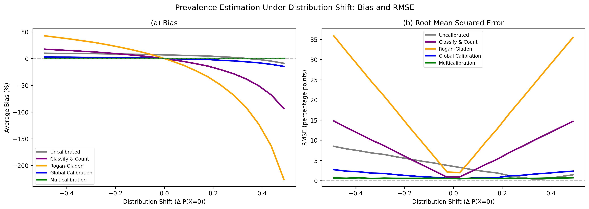
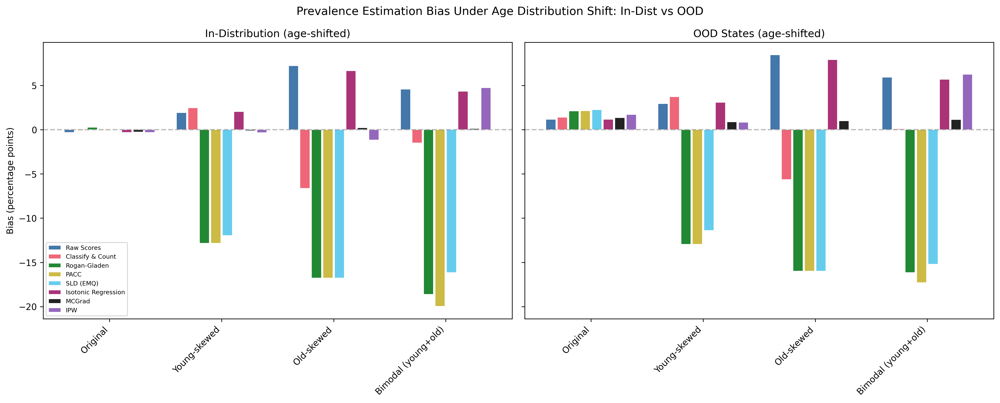

# Introduction

Researchers in nearly every field frequently aim to measure the prevalence of a category within a target population. This includes use of diagnostic tests to measure disease prevalence, tracking prevalence of phenomena on online platforms, and quantifying document frequencies in a corpus. Recently, large language models (LLMs) have dramatically expanded the ease and reduced the cost of this kind of measurement. Researchers now routinely deploy LLMs as zero-shot measurement devices to estimate the prevalence of phenomena that previously required expensive manual annotation.

Applications span the social sciences, where LLMs code democracy indicators across countries [@weidmann2025democracy], classify protest events in news corpora [@overos2024protest], and categorize open-ended survey responses at near-human accuracy [@mellon2024survey; @gilardi2023chatgpt]; clinical medicine, where they extract diagnostic attributes from pathology reports [@sushil2024clinical] and identify goals-of-care discussions in clinical notes [@sibley2025goc]; and the digital humanities, where they annotate art forms in auction records [@tojima2025art] and convert qualitative text into quantitative variables across multiple languages [@karjus2025mixed]. LLMs are also being advertised for content moderation^[<https://openai.com/index/using-gpt-4-for-content-moderation/>] and LLM "judges" are used to assess the quality and safety of AI systems [@zheng2023judging; @yuan2024selfrewarding]. The central promise of these model-based measurements is extrapolation: the ability to estimate prevalence in new populations, time periods, or subgroups where manual annotation is infeasible due to scale or too expensive using traditional human annotation. While model-based quantification is more affordable, it typically comes with the risk of false positive and false negative classification errors. However, commonly used remedies for these errors fail when the target population differs from the population on which the device's error properties were assessed.

Current quantification methods, such as "Classify & Count" or "Adjusted Count" (Rogan-Gladen), offer adjustments that attempt to correct for imperfect devices [@gonzalez2017review]. However, these methods rely on a fragile assumption: that the device's error properties (sensitivity, specificity, or calibration) remain static across populations. In reality, a model's performance often varies drastically across subgroups. When the composition of the target population differs from the source population, these subgroup-specific errors no longer cancel out, leading to biased prevalence estimates.

We propose multicalibration as the necessary and sufficient condition for accurate, out-of-domain prevalence estimation. Building on recent theoretical advances in algorithmic fairness and domain adaptation [@kim2022universal], we leverage the fact that a multicalibrated classifier achieves 'Universal Adaptability' to solve the prevalence estimation problem. We show that this theoretical guarantee allows for unbiased estimates on any downstream target population without the need for target-specific re-weighting or retraining. This robustness is critical for nearly all practical applications of quantification, including applying a model to previously unseen datasets, tracking changes in prevalence over time, or analyzing subsets of the training population. In contrast, we show that simple calibration or any adjustment-oriented quantification technique is insufficient for unbiased estimation except in trivial and unrealistic settings.

We review existing approaches to the quantification problem, connect the quantification task to the broader theory of domain adaptation via multicalibration, demonstrate the need for multicalibration to achieve unbiased estimates of prevalence in out-of-domain settings, and apply those insights to a few real-world datasets.

# AI Systems as Measurement Devices

[TODO: Explicit review, maybe split into application papers and methodology papers]

# Calibrated Measurement Devices are Biased under Distribution Shift

Assume a binary problem with outcome $y \in \{0, 1\}$ and a set of relevant features $X$. The researcher relies on an imperfect device, $h(X)$, such as an AI system, diagnostic test, a human annotator, or a machine learning classifier. The task of "quantification" is to estimate the true prevalence, $P(y=1)$, in a target population using only the device's outputs. We assume that the causal direction of the data generating process is $X \to Y$ and that $P(Y|X)$ is stable (see @wu2024stable for an extensive discussion of these assumptions). It is well understood that naively averaging the model's predictions will lead to biased estimates of prevalence [@gonzalez2017review]. Several methods are commonly used to adjust or *calibrate* a model to produce unbiased estimates. In this section, we will explore some of these methods and demonstrate how they fail if the target population has a different distribution of features $X$ (covariate or mix-shift).

## Existing Calibration Approaches

The most intuitive approach, "Classify & Count," simply tallies the device's positive predictions. Such predictions are obtained by thresholding if the model produces a continuous score. For many AI systems that produce natural language output a binary (e.g. yes/no) answer is the native output. However, this method is fundamentally flawed; even highly accurate devices yield biased estimates whenever the false positive and false negative rates are non-zero and uncorrected. To address this, the quantification literature has historically relied on error correction methods, such as the "Adjusted Count" (AC) [@rogan1978estimating]. These methods use a classifier's fixed error rates (TPR and FPR) estimated from training data to invert the confusion matrix and recover the true prevalence [@gonzalez2017review].

Adjusted Count is a *calibration* technique. If a device is perfectly calibrated (i.e., its predicted probabilities match empirical frequencies), averaging its predictions yields an unbiased prevalence estimate. Reformulating Adjusted Count, we can treat the device's classifications as real numbers rather than discrete predicted values $\{0,1\}$, which correspond to the prevalence within each predicted class. Positively classified examples are scored by the TPR and negatively classified examples are scored by $1 - \text{FPR}$. These scores satisfy the definition of calibration that $E[y \mid \hat{y}] = y$. The Adjusted Count (Rogan-Gladen) estimate is equivalent to the mean of these scores.

A prediction $\hat{y}$ is perfectly calibrated if and only if $P(y = 1 \mid \hat{y} = p) = p$, where $p$ is the true underlying probability. Intuitively, for all $\hat{y} = 0.8$, we expect that 80% of them have 1 as a label.

Corrections such as AC rely on a strict and often unrealistic assumption: they assume that while the class prevalence $P(y)$ may change, the distribution of features within each class, $P(X|y)$, remains constant between the training and target populations. This assumption of "Feature Stability" fails in most real-world out-of-distribution (OOD) settings. For example, if a device is applied to a specific demographic subgroup or a future time period, the features characterizing the positive class often shift, altering the device's error rates and rendering the standard correction invalid [@wu2024stable]. This can be demonstrated for AC. Consider a population consisting of two groups, indexed by $i$, of sizes $\{k, 1-k\}$. Each group is defined by a prevalence, $p_i$, and error rates $\text{FPR}_i$ and $\text{FNR}_i$. The apparent overall FPR and FNR of the population is a weighted average of the error rates for the two groups. In the presence of a "mix shift" that changes the relative sizes of these groups $\{k^*, 1-k^*\}$, the learned TPR and TNR will no longer be an appropriately weighted average of the target population group-level error rates, $\{\text{TPR}^*, \text{TNR}^*\}$. Estimated prevalence---corrected by an inappropriate global confusion matrix---will be biased. Despite achieving "calibration" in the original population, this learned calibration does not always hold.

[TODO: Paragraph that connects this to other methods like @wu2024stable, King, and other quantification work, showing/arguing the same failure mode holds]

[TODO: Something about why we should care about bias (versus variance)]

While theoretically sound, reliance on global calibration introduces a subtle but critical failure mode. A device can be *globally* calibrated on a training set---accurate on average---while being grossly *miscalibrated* on specific subgroups, even within the training distribution. When researchers apply such a model to a new domain---whether a specific demographic subset, a new geographic region, or a future time period---the global calibration curve often fails to hold. This failure occurs because most real-world distribution shifts are effectively changes in the composition of the population. If the device is miscalibrated on the underlying subgroups that make up the population, any shift in their proportions will bias the aggregate estimate. This phenomenon, which we term *mis-multicalibration*, violates the Calibration Stability assumption locally and negatively impacts generalization. Consequently, neither standard error-correction methods (which assume stable features) nor standard calibration methods (which assume stable global calibration) can yield unbiased estimates under shift.

To illustrate our theoretical results, we use a simulation with the following structure. We generate synthetic data with a binary covariate $X \in \{0, 1\}$ and binary outcome $Y \in \{0, 1\}$, where $P(Y=1|X=1) = 0.85$ and $P(Y=1|X=0) = 0.15$. A classifier produces probability estimates $\hat{p}$ that are systematically miscalibrated: underestimating by 10% when $X=0$ and overestimating by 10% when $X=1$. All calibration parameters are learned on a training distribution with $P(X=0) = 0.5$. We then evaluate estimation methods on test distributions where $P(X=0)$ ranges from 0.01 to 0.99, representing covariate shift. The marginal distribution $P(X)$ changes while the conditional $P(Y|X)$ remains fixed. The simulation is repeated 50 times.

*Figure 1: Average bias of prevalence estimates under covariate shift for five estimation methods: Uncalibrated, Classify & Count, Rogan-Gladen, Global Calibration, and Multicalibration. Only multicalibration maintains near-zero bias across all levels of distribution shift.*

Figure 1 displays the average bias across 50 simulation runs for all five estimation methods. The y-axis shows the bias in global prevalence estimates under varying covariate shift, which is displayed on the x-axis. It can be seen that with zero distribution shift---the center of the figure---the raw score average is biased by about 7%. The classify-and-count, calibration, and the Rogan-Gladen estimators show no bias when there is no distribution shift, but their prevalence estimates are biased if the distribution shifts. The threshold based estimators (CC, and RG) are much more prone to extreme bias---in this sample up to 250%---as the covariate shift becomes more extreme. The calibrated scores are less susceptible to such bias amplification. In contrast, the multicalibrated estimator maintains near-zero bias across the entire range of distribution shifts.

## Multicalibration

To guarantee accurate quantification in out-of-domain settings, a device must satisfy multicalibration: it must be calibrated not just on average, but simultaneously across all practically relevant subpopulations. By ensuring the device is reliable on these "atomic" components, multicalibration provides robustness not just for subsetting, but for generalizing to any future distribution composed of these groups [@gopalan2022omnipredictors]. Multicalibration was initially introduced as a fairness criterion [e.g., @hebertjohnson2018multicalibration; @blasiok2023loss] and a growing body of research showed its relevance to several aspects of model performance and robustness. Formally, let $X$ denote features, $Y \in \{0,1\}$ an outcome, and $f(X) \in [0,1]$ a predictor interpreted as a probability. Given a collection $\mathcal{G}$ of subgroups $G \subseteq \mathcal{X}$ (for example, groups defined by demographic attributes or by arbitrary computable functions of $X$), $f$ is said to be $\alpha$-multicalibrated with respect to $\mathcal{G}$ if, for every group $G \in \mathcal{G}$ and every prediction value $v$ used by the model, the conditional expectation satisfies

$$\left| \mathbb{E}[Y \mid f(X)=v, X \in G] - v \right| \le \alpha,$$

whenever the conditioning event has sufficient probability mass. In words, within each subgroup and at each score level, the average observed outcome closely matches the predicted probability. This notion strengthens classical calibration, which requires the condition only over the entire population, by enforcing reliability across a rich family of subpopulations, potentially exponential in size.

[TODO: Fill how this applies to measurement and illustrate with simulation]

# Empirical Application: Employment Prevalence Under Age Distribution Shift

The simulation study above uses a stylized data-generating process to demonstrate the theoretical failure mode. We now show that the same phenomenon arises in practice, using real survey data and a realistic machine learning pipeline.

## Data and Setup

We use the American Community Survey (ACS), a large-scale annual survey conducted by the U.S. Census Bureau. The prediction task is binary employment status (employed vs. not employed), with 16 sociodemographic features including age, education, marital status, disability status, citizenship, and military service. We load data from eight geographically diverse training states (TX, MI, PA, OH, IL, GA, NC, VA) across survey years 2016--2018, yielding approximately 3 million observations. Six additional states (CA, NY, FL, WA, AZ, CO) are held out for out-of-distribution (OOD) evaluation.

A logistic regression classifier is trained on 1.5 million observations. The remaining in-distribution data is split into a calibration set ($n \approx 644{,}000$) and a test set ($n \approx 920{,}000$). We fit two post-hoc calibration methods on the calibration set:

1. **Isotonic Regression** --- a standard global calibration method that learns a monotone mapping from predicted scores to calibrated probabilities.
2. **MCGrad** --- a multicalibration algorithm that iteratively corrects predictions to achieve calibration conditional on subgroups defined by both categorical features (marital status, disability, citizenship, etc.) and numerical features (age, education level).

We compare prevalence estimates from five methods: raw (uncalibrated) scores, Classify & Count with a prevalence-matched threshold, the Rogan-Gladen adjustment, Isotonic Regression, and MCGrad.

## Synthetic Age Distribution Shift

Employment rates vary dramatically by age: approximately 47% for ages 16--24, 76% for ages 25--54, 61% for ages 55--64, and only 17% for ages 65 and older. This 30--40 percentage point variation across age groups makes age an ideal dimension along which to construct meaningful distribution shifts.

We create synthetic target populations by resampling the test data with different age distributions:

- **Original**: no resampling (baseline).
- **Young-skewed**: heavily oversamples ages 16--30, producing a population with mean age $\approx 10$ and true employment rate of 12.8%.
- **Old-skewed**: heavily oversamples ages 60+, producing a population with mean age $\approx 77$ and true employment rate of 16.8%.
- **Bimodal**: oversamples both young and old, undersamples the middle, with true employment rate of 21.1%.

All calibration parameters are estimated once on the original calibration set and held fixed across scenarios.

## Results

*Figure 2: Prevalence estimation bias (in percentage points) under synthetic age distribution shift, for in-distribution data (left) and out-of-distribution states (right).*

Table 1 reports the bias of each estimation method across the four age-shift scenarios, for both the in-distribution and OOD settings.

| Setting | Age Dist.    | True Prev. | Raw Scores | CC      | Rogan-Gladen | Isotonic | MCGrad  |
|---------|--------------|------------|------------|---------|--------------|----------|---------|
| In-Dist | Original     | 46.0%      | -0.31      | -0.07   | +0.26        | -0.30    | -0.27   |
| In-Dist | Young-skewed | 12.8%      | +1.93      | +2.47   | -12.82       | +2.04    | -0.11   |
| In-Dist | Old-skewed   | 16.8%      | +7.23      | -6.62   | -16.77       | +6.65    | +0.22   |
| In-Dist | Bimodal      | 21.1%      | +4.57      | -1.50   | -18.62       | +4.33    | +0.12   |
| OOD     | Original     | 45.1%      | +1.15      | +1.40   | +2.12        | +1.17    | +1.35   |
| OOD     | Young-skewed | 13.0%      | +2.93      | +3.73   | -12.96       | +3.08    | +0.88   |
| OOD     | Old-skewed   | 16.0%      | +8.47      | -5.64   | -15.97       | +7.91    | +1.01   |
| OOD     | Bimodal      | 20.8%      | +5.91      | +0.09   | -16.14       | +5.69    | +1.13   |

*Table 1: Prevalence estimation bias in percentage points (pp) under synthetic age distribution shift.*

With no age shift (Original), all methods produce approximately unbiased estimates. Under age distribution shift, however, the methods diverge sharply.

The Rogan-Gladen adjustment exhibits catastrophic failure, with bias reaching $-$12.8 to $-$18.6 percentage points in the in-distribution setting---effectively estimating zero or negative prevalence. This occurs because the TPR and FPR, estimated on the original age distribution, become invalid when the age mix shifts.

Isotonic Regression and raw scores show substantial bias of 2--7 percentage points under shift. Because these methods learn a global mapping from scores to probabilities, they cannot account for the fact that the age composition of the target population has changed. The global calibration curve, which was accurate on average in the training distribution, no longer reflects the true relationship when particular age groups are over- or under-represented.

Classify & Count also fails under shift. In the old-skewed scenario, it underestimates prevalence by 6.6 percentage points; in the young-skewed scenario, it overestimates by 2.5 percentage points. The threshold learned on the calibration set no longer separates the classes appropriately when the age distribution changes.

MCGrad produces near-zero bias across all in-distribution age-shift scenarios ($\leq$ 0.27pp). Because MCGrad is multicalibrated with respect to age, its predicted probabilities are correct *conditional on age*. When the age distribution shifts, the stratum-level predictions remain valid, and the average of the calibrated scores still tracks the true prevalence.

In the OOD setting---where the model is applied to states never seen during training *and* the age distribution is shifted---MCGrad's advantage persists, though with modestly larger bias (0.88--1.35pp) reflecting the additional geographic shift. Even so, MCGrad's bias remains 3--8$\times$ smaller than the next best method.

# Appendix

## Simulation Study Setup

### Data Generating Process

We generate synthetic data with a binary covariate $X \in \{0, 1\}$ and binary outcome $Y \in \{0, 1\}$. The conditional outcome probabilities are:

$$P(Y=1|X=1) = 0.85, \quad P(Y=1|X=0) = 0.15$$

A simulated classifier produces probability estimates $\hat{p}$ that are systematically miscalibrated within each stratum:

- For $X=0$: $\hat{p} = P(Y=1|X=0) \times 0.9 = 0.135$ (10% underestimation)
- For $X=1$: $\hat{p} = P(Y=1|X=1) \times 1.1 = 0.935$ (10% overestimation)

This setup represents a classifier whose predictions are directionally correct but exhibit stratum-specific bias---a common pattern in real-world machine learning systems.

### Covariate Shift Protocol

All calibration parameters are learned on a training distribution with $P(X=0) = 0.5$. We then evaluate prevalence estimation accuracy across shifted test distributions where $P(X=0)$ varies from 0.01 to 0.99. This range represents the full spectrum of potential distribution shifts, from populations dominated by $X=1$ to those dominated by $X=0$.

The key assumption is that of covariate shift: while the marginal distribution $P(X)$ changes between training and test, the conditional distribution $P(Y|X)$ remains constant.

### Prevalence Estimation Methods

We compare five methods for estimating population prevalence $\pi = P(Y=1)$:

1. **Uncalibrated Averaging**
$$\hat{\pi}_{\text{uncal}} = \frac{1}{n}\sum_{i=1}^{n} \hat{p}_i$$
The raw average of predicted probabilities without any correction.

2. **Classify and Count (CC)**
$$\hat{\pi}_{\text{CC}} = \frac{1}{n}\sum_{i=1}^{n} \mathbb{1}[\hat{p}_i \geq \tau]$$
Predictions are binarized at threshold $\tau$, chosen on calibration data to match true prevalence, then the positive proportion is computed.

3. **Rogan-Gladen Adjustment**
$$\hat{\pi}_{\text{RG}} = \frac{\bar{p} - \text{FPR}}{\text{TPR} - \text{FPR}}$$
A classical epidemiological correction where $\text{TPR} = \mathbb{E}[\hat{p}|Y=1]$ and $\text{FPR} = \mathbb{E}[\hat{p}|Y=0]$ are estimated from calibration data.

4. **Global Calibration**
$$\hat{\pi}_{\text{cal}} = \alpha \cdot \bar{p}, \quad \text{where } \alpha = \frac{\bar{Y}_{\text{cal}}}{\bar{p}_{\text{cal}}}$$
A multiplicative correction factor learned to match expected prevalence on calibration data.

5. **Multicalibration**
$$\hat{\pi}_{\text{MC}} = \frac{1}{n}\sum_{i=1}^{n} (\hat{p}_i + \delta_{X_i}), \quad \text{where } \delta_x = \mathbb{E}[Y|X=x] - \mathbb{E}[\hat{p}|X=x]$$
Stratum-specific additive corrections that ensure calibration conditional on $X$.

### Simulation Procedure

For each of $B=50$ bootstrap iterations:

1. Generate fresh calibration data ($n=10{,}000$) from the training distribution ($P(X=0)=0.5$)
2. Estimate all calibration parameters from this data
3. For each of 20 test distributions with $P(X=0) \in [0.01, 0.99]$:
   - Generate test data ($n=10{,}000$)
   - Apply each estimation method using the learned calibration parameters
   - Compute percentage bias: $\text{Bias\%} = 100 \times \frac{\hat{\pi} - \pi_{\text{true}}}{\pi_{\text{true}}}$

This bootstrap procedure properly accounts for estimation variance in calibration parameters.

### Results

Multicalibration produces unbiased prevalence estimates across all distribution shifts (bias $\approx 0\%$ throughout). This robustness arises because multicalibration ensures $\mathbb{E}[\hat{p}|X] = \mathbb{E}[Y|X]$ for each stratum. Under covariate shift, where $P(Y|X)$ is invariant, these stratum-level corrections remain valid regardless of changes in $P(X)$.

Global Calibration and Classify-and-Count exhibit similar bias patterns: zero bias at the training distribution ($P(X=0)=0.5$) but linearly increasing bias as the distribution shifts. At extreme shifts, bias reaches approximately $\pm 15\%$.

Uncalibrated estimates show moderate shift sensitivity with bias scaling approximately linearly with distribution shift magnitude.

Rogan-Gladen adjustment exhibits the most severe bias amplification, with bias exceeding $\pm 40\%$ at extreme shifts. This instability stems from two factors: (1) TPR and FPR parameters estimated on training data become incorrect under shift, and (2) the ratio estimator's small denominator ($\text{TPR} - \text{FPR}$) amplifies estimation errors.

### Implications

These results demonstrate that for applications where covariate shift is expected---such as deploying models across populations with different demographic compositions---multicalibration provides the most robust prevalence estimates. The critical requirement is that calibration corrections be learned conditional on covariates that may shift at deployment time. Standard calibration approaches that only ensure marginal calibration ($\mathbb{E}[\hat{p}] = \mathbb{E}[Y]$) are insufficient under distribution shift.

# References
