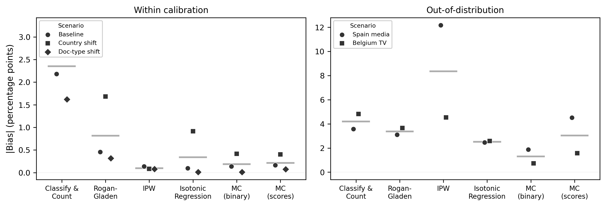

^1^Meta Platforms Inc., ^2^The London School of Economics and Political Science

**Corresponding author:** Fridolin Linder (flinder@meta.com)

**Classification:** Social Sciences / Political Science; Physical Sciences / Statistics

**Keywords:** multicalibration | large language models | prevalence estimation | covariate shift | quantification

\newpage

## Significance

Large language models are increasingly used as measurement devices to estimate prevalence in populations. A critical but overlooked problem arises when the target population differs from the validation population: standard methods produce biased prevalence estimates, even when the model achieves high classification accuracy. We show that multicalibration, requiring a device to be accurate conditional on input features---rather than just on average---is sufficient for unbiased prevalence estimation under covariate shift. Our theoretical and empirical results imply that the rapidly growing body of LLM-based measurement research is vulnerable to systematic bias that can be mitigated by enforcing multicalibration.

## Abstract

Estimating the prevalence of a category in a population using imperfect measurement devices (diagnostic tests, classifiers, or large language models) is fundamental to science, public health, and online trust and safety. Standard approaches correct for known device error rates but assume these rates remain stable across populations. We show this assumption fails under covariate shift and that multicalibration, which enforces calibration conditional on the input features rather than just on average, is sufficient for unbiased prevalence estimation under such shift. Standard calibration and quantification methods fail to provide this guarantee. Our work connects recent theoretical work on fairness to a longstanding measurement problem spanning nearly all academic disciplines. A simulation confirms that standard methods exhibit bias growing with shift magnitude, while a multicalibrated estimator maintains near-zero bias. While we focus the discussion mostly on LLMs, our theoretical results apply to any classification model. Two empirical applications---estimating employment prevalence across U.S. states using the American Community Survey, and classifying political texts across four countries using an LLM---demonstrate that multicalibration substantially reduces bias in practice, while highlighting that calibration data should cover the key feature dimensions along which target populations may differ.

# Introduction

Large language models (LLMs) are increasingly used as measurement devices for estimating the prevalence of a category in a population. Researchers now routinely deploy LLMs as zero-shot classifiers to estimate the frequency of phenomena that previously required expensive manual annotation: coding democracy indicators across countries [@weidmann2026democracy], classifying protest events in news corpora [@overos2024protest], estimating party policy positions from manifestos across dozens of countries and languages [@benoit2026llm], categorizing open-ended survey responses at near-human accuracy [@mellon2024survey; @gilardi2023chatgpt], extracting diagnostic attributes from pathology reports [@sushil2024clinical], identifying goals-of-care discussions in clinical notes [@lee2025assessment], annotating art forms in auction records [@tojima2025art], and converting qualitative text into quantitative variables across multiple languages [@karjus2025mixed]. LLMs are also being deployed for content moderation^[<https://openai.com/index/using-gpt-4-for-content-moderation/>] and as LLM "judges" to assess the quality and safety of AI systems [@zheng2023judging; @yuan2024selfrewarding].

These applications are typically validated by reporting discriminative performance: accuracy, AUC, or agreement with human annotations. Researchers then use or advocate for using validated LLMs as measurement devices across new populations, time periods, or subgroups. But strong discriminative performance does not guarantee accurate prevalence estimates from the classifications provided by these devices. When the composition of the target population differs from the validation population, a model that separates positives from negatives well can still produce prevalence estimates that are substantially biased, because discrimination is invariant to the calibration errors that drive prevalence bias. This problem is often missed in standard validation practice and, as we show, can produce large bias even with strong classification performance.

Neither the confidence elicitation literature nor the quantification^[The task of estimating prevalence from imperfect classifiers is known as *quantification* in the machine learning literature; we use this term interchangeably with *prevalence estimation*.] literature solves this problem. Confidence elicitation methods — verbalized confidence [@tian2023verbalized], token log-probabilities [@kadavath2022language], consistency sampling [@wang2023selfconsistency] — replace the LLM's bare binary classification with a probability score, and post-hoc calibration [@oliveira2025calibration] can further refine those scores. Both target *global* calibration: calibration on the population where they are evaluated. Empirical evidence confirms that such calibration does not transfer: it degrades 2--3$\times$ under language shift even when accuracy is preserved [@yang2023calibration], and varies widely across tasks and domains [@ren2025predicting]. Quantification methods such as "Classify & Count", "Adjusted Count", and the Saerens-Latinne-Decaestecker (SLD) EM algorithm (see @gonzalez2017review for a detailed survey) attempt to correct for classifier errors directly, but rely on the assumption that error properties remain static across populations. Importance-weighted methods handle covariate shift in principle but require re-estimating density ratios for each new target population. None of these approaches provides a measurement device that can be validated once and then reliably applied to new populations.

We show that multicalibration — calibration conditional on the input features, not just on average — fills this gap. Building on @kim2022universal's "Universal Adaptability" result, we show that a multicalibrated device requires no target-specific estimation: it is calibrated once on source data and produces unbiased prevalence estimates on any target population whose features lie within the calibration support. This property is critical for LLM-based measurement, where a single device is typically applied to many populations without the opportunity to re-calibrate for each one. Multicalibration can be applied to any LLM output — from discrete Yes/No classifications (the standard practice in applied research) to continuous confidence scores — because it operates on the scores' relationship to outcomes *conditional on features*, not on the scores' intrinsic quality. Our results apply more generally to any model-based measurement device, but the LLM setting is where the practical need is most urgent and the calibration problem most overlooked.

We review existing approaches to the quantification problem, connect the quantification task to the broader theory of domain adaptation via multicalibration, and apply those insights to two empirical applications: a controlled demonstration using a standard ML classifier to estimate employment prevalence under age distribution shift (American Community Survey), followed by the main application of classifying political texts across four countries using an LLM as a zero-shot measurement device.

# Results

## Standard calibration methods fail under covariate shift

Consider a binary outcome $Y \in \{0, 1\}$, features $X$, and a device $h(X) \in [0,1]$ producing probabilistic predictions. The goal is to estimate population prevalence $\pi = P(Y=1)$ in a target population using only unlabeled target data $\{X_i\}$ and the device $h$. We focus on *covariate shift* [@storkey2009dataset], where $P(X)$ changes across populations but $P(Y \mid X)$ remains stable. This is the natural assumption when features causally influence outcomes ($X \to Y$), as in many measurement applications. See Limitations for discussion of label shift ($Y \to X$) and concept drift.

A device is *globally calibrated* if $\mathbb{E}[Y \mid h(X) = p] = p$ for all prediction values $p$. Under global calibration, $\mathbb{E}[h(X)] = \mathbb{E}[Y] = \pi$, so the sample mean of predictions is an unbiased prevalence estimate. However, global calibration is a property of a *specific* population. A device calibrated on one population need not be calibrated on another, even under covariate shift with stable $P(Y \mid X)$.

The failure mechanism is as follows. Suppose the population consists of subgroups $G$ with weights $w_G$. Within each subgroup, the device may be biased: let $\epsilon_G = \mathbb{E}[Y - h(X) \mid X \in G]$ denote the mean prediction error within group $G$. Global calibration requires only that these errors cancel on average: $\sum_G w_G \epsilon_G = 0$. Under covariate shift, the group weights change to $w_G^*$, and the bias in the prevalence estimate becomes $\sum_G w_G^* \epsilon_G$, which is generally nonzero unless $\epsilon_G = 0$ for all $G$. A device can be perfectly globally calibrated, with errors that precisely cancel in the training population, while having nonzero mean prediction error within every individual subgroup.

Standard quantification methods are each vulnerable to this failure mechanism [@gonzalez2017review]. Classify & Count, Rogan-Gladen adjustment [@rogan1978estimating], and Probabilistic Adjusted Classify & Count (PACC) all rely on error rates or conditional score means estimated from calibration data; these are weighted averages over subgroups and shift with population composition. The SLD/EMQ algorithm [@saerens2002adjusting] and more recent distribution-matching methods such as DyS and HDy [@maletzke2018quantification] assume label shift ($P(X \mid Y)$ stable) and fail under covariate shift. Even global calibration via isotonic regression, recommended by @calibrateextrapolate2024 for covariate shift settings, produces biased prevalence estimates because global calibration does not guarantee feature-conditional accuracy.

## Multicalibration guarantees unbiased prevalence estimation

The analysis above shows that all standard methods produce biased prevalence estimates under covariate shift, with bias $\sum_G w_G^* \epsilon_G$ that is generally nonzero unless every $\epsilon_G = 0$.

Multicalibration [@hebertjohnson2018multicalibration] formalizes this requirement. A predictor $f(X)$ is *multicalibrated* with respect to a collection of subgroups $\mathcal{G}$ if $\mathbb{E}[Y \mid f(X) = v, X \in G] = v$ for every $G \in \mathcal{G}$ and prediction value $v$. When $\mathcal{G}$ is rich enough to capture all relevant structure in $X$, this is equivalent to requiring calibration conditional on the full feature space:

$$\mathbb{E}[Y \mid f(X) = v, X = x] = v$$

for all $x$ and $v$ with sufficient probability mass. This is the framing of @kim2022universal's "Universal Adaptability": a predictor calibrated conditional on $X$ yields correct expected values under any reweighting of $P(X)$, without requiring knowledge of the shift.

The connection to prevalence estimation is direct. If $f$ is calibrated conditional on $X$, then $\mathbb{E}[f(X) \mid X = x] = \mathbb{E}[Y \mid X = x]$ for all $x$. Under covariate shift, where only $P(X)$ changes while $P(Y \mid X)$ remains stable, the law of iterated expectations gives (where $\mathbb{E}^*$ and $P^*$ denote expectations and probabilities under the target distribution, and $\pi^* = P^*(Y\!=\!1)$ is the target prevalence):

$$\mathbb{E}^*[f(X)] = \int \mathbb{E}[f(X) \mid X = x] \, dP^*(x) = \int \mathbb{E}[Y \mid X = x] \, dP^*(x) = \mathbb{E}^*[Y] = \pi^*.$$

Because predictions are correct at each point in the feature space, the average of predictions tracks the true prevalence under *any* change in $P(X)$.

The condition strictly necessary for this robustness is *multi-accuracy*: $\mathbb{E}[f(X) - Y \mid X \in G] = 0$ for all groups $G$ that the shift can reweight. Multicalibration, which additionally requires $\mathbb{E}[Y \mid f(X) = v, X \in G] = v$, is strictly stronger and implies multi-accuracy. Multicalibration is the preferable target for three reasons. First, practical post-hoc algorithms like MCGrad [@tax2026mcgrad]^[An open-source implementation is available at <https://mcgrad.dev>.] naturally produce multicalibrated predictors [@hebertjohnson2018multicalibration], so the stronger guarantee comes at no additional cost. Second, multicalibration covers a broader set of use cases where multi-accuracy no longer suffices and full calibration conditional on both features and score level is required: when the population shift is mediated by the device's scores (e.g., using the device's scores to decide which items to label, or threshold-based filtering), when prevalence is estimated within score strata, or when scores are used as inputs to downstream regressions. Third, multicalibration provides robustness against misspecification of which features drive the shift, since a predictor multicalibrated with respect to a rich class of subgroups is automatically multi-accurate for any sub-partition. Both conditions require that the calibration features capture the dimensions along which the population shift occurs (an ignorability assumption).

## Simulation: standard methods fail, multicalibration succeeds

We illustrate the theoretical results above with a simulation. We generate data with a binary covariate $X \in \{0,1\}$ and binary outcome $Y$, where $P(Y=1 \mid X=1) = 0.85$ and $P(Y=1 \mid X=0) = 0.15$. We simulate a classifier with hardcoded, systematically biased predictions: 10% underestimation when $X=0$ and 10% overestimation when $X=1$. All calibration parameters are learned on a balanced training distribution ($P(X=0) = 0.5$). Prevalence is estimated by averaging the predicted probabilities over the target sample. We then evaluate prevalence estimates on test distributions where $P(X=0)$ ranges from 0.01 to 0.99, repeating 50 times (details in Materials and Methods).

{width=100%}

*Figure 1: Prevalence estimation bias (% relative) under covariate shift, averaged over 50 simulation runs. The x-axis shows $\Delta P(X\!=\!0)$, the change in $P(X\!=\!0)$ from the training value of 0.5. Classify & Count and Rogan-Gladen diverge with increasing shift; isotonic regression (global calibration) shows moderate bias; MCGrad maintains near-zero bias across all shift levels. Classify & Count and Rogan-Gladen curves are cropped at the $\pm 40\%$ axis limits; their bias continues to grow beyond this range, exceeding $\pm 100\%$ at extreme shifts (see SI Appendix Figure S3 for full range). Additional methods (PACC, SLD, uncalibrated averaging) also shown in SI Appendix Figure S3.*

Figure 1 shows the results. At the training distribution (center), all methods produce approximately unbiased estimates. As the distribution shifts, the methods diverge. Rogan-Gladen is particularly unstable: its ratio structure amplifies estimation errors, with bias exceeding $\pm40\%$ at extreme shifts. Classify & Count shows growing bias in the same direction. Isotonic regression (global calibration) shows more moderate but still substantial bias (up to 15% at extreme shifts). SLD and PACC exhibit comparably large failures (SI Appendix Figure S3). The multicalibrated estimator maintains near-zero bias and the lowest RMSE across the entire range of distribution shifts (SI Appendix Figure S2), confirming that the bias reduction does not come at the cost of increased variance.

## Empirical application: employment prevalence under age distribution shift

Before applying multicalibration to LLM-generated scores, which present additional challenges such as coarse discretization and non-standard score distributions, we first demonstrate the core mechanism in a controlled setting with a traditional machine learning classifier. We analyze data from the American Community Survey (ACS), a large-scale annual survey conducted by the U.S. Census Bureau. The concept to be measured is the rate of employment. The measurement device is a logistic regression model of binary employment status, with 16 sociodemographic features including age, education, marital status, disability status, and citizenship.

**Setup.** We train a logistic regression classifier on data from eight U.S. states (TX, MI, PA, OH, IL, GA, NC, VA) across 2016--2018, totaling approximately 1.5 million training observations. The remaining in-distribution data is split into a calibration set ($n \approx 644{,}000$) and a test set ($n \approx 920{,}000$). Six additional states (CA, NY, FL, WA, AZ, CO) are held out for out-of-distribution (OOD) evaluation. We fit two post-hoc calibration methods on the calibration set: isotonic regression (global calibration) and MCGrad, a multicalibration algorithm that enforces calibration conditional on both categorical and numerical features. We compare five prevalence estimation methods (Figure 2): Classify & Count with a prevalence-matched threshold, Rogan-Gladen adjustment, importance-weighted estimation (IPW), isotonic regression, and MCGrad. Additional methods (PACC, SLD, uncalibrated averaging) are reported in SI Appendix Table S1.

**Age distribution shift.** Employment rates vary dramatically by age: approximately 47% for ages 16--24, 76% for ages 25--54, 61% for ages 55--64, and 17% for ages 65+. This makes age an ideal dimension along which to construct meaningful distribution shifts. We create synthetic target populations by resampling test data with shifted age distributions: young-skewed (oversampling ages 16--30), old-skewed (oversampling ages 60+), and bimodal (oversampling both tails). The resulting populations have true employment rates ranging from 12.8% to 46.0%. All calibration parameters are estimated once on the original calibration set and held fixed across scenarios.

{width=100%}

*Figure 2: Prevalence estimation |bias| (percentage points) under synthetic age distribution shift, for in-distribution states (left) and out-of-distribution states (right). Each marker shape represents a different age shift scenario; horizontal lines show the mean across scenarios. Full numerical results in SI Appendix Table S1.*

**Results.** With no age shift, all methods produce approximately unbiased estimates (Figure 2). Under shift, the methods diverge sharply. Rogan-Gladen fails severely (12--19pp bias under age shift). SLD, designed for label shift rather than covariate shift, shows comparably large bias (SI Appendix Table S1). Classify & Count and isotonic regression show moderate but growing bias (up to 8pp under age shift). IPW performs well on simple shifts ($\leq 1.2$pp) but fails on the bimodal shift (+4.7pp in-distribution, +6.3pp OOD) where the density ratio is hard to model.

MCGrad produces near-zero bias across all in-distribution scenarios ($\leq 0.27$pp), including the bimodal shift where IPW struggles. In the OOD setting (held-out states with age shift), MCGrad's bias increases modestly (0.88--1.35pp), reflecting geographic shift along an uncalibrated dimension. Even so, MCGrad maintains the lowest bias and RMSE across all scenarios.

## LLM-based topic classification under cross-national shift

The ACS application uses a standard machine learning classifier with well-distributed probability estimates. We now examine the setting that more immediately motivates this paper: using an LLM as a zero-shot measurement device across multiple countries and languages. We compare two LLM output modes that reflect current practice and the confidence elicitation literature, respectively: (1) discrete Yes/No classifications, which is how LLMs are used in all of the applied studies cited in the introduction, and (2) probability scores obtained via direct probability elicitation, where the LLM estimates $P(\text{Yes})$ and $P(\text{No})$ without first committing to an answer. This design lets us test whether confidence elicitation improves prevalence estimation, and whether multicalibration is needed in either case.

**Setup.** We use Claude Opus 4.6 to classify 30,000 political texts from the Comparative Agendas Project [@baumgartner2006cap] as related to Law & Crime (CAP major topic code 12). The data comprises six sub-populations across four countries and four languages (5,000 documents each): Danish parliamentary questions, Spanish oral questions, U.S. congressional bills, Belgian newspaper articles, Spanish media articles, and Belgian TV news. Each document is classified twice in independent campaigns: once for a binary Yes/No label, and once for direct probability estimates $P(\text{Yes})$ and $P(\text{No})$ (summing to 1.0). The LLM achieves strong discriminative performance: AUC 0.960 for binary labels and 0.987 for probability scores on the in-distribution test set, with per-language AUCs of 0.983--0.994 for the probability scores.

The calibration set ($n \approx 13{,}400$) draws equally from four sub-populations (Denmark questions, Spain questions, U.S. bills, Belgium newspaper), ensuring that all four countries and languages are represented. Two sub-populations are held out as out-of-distribution targets: Spanish media and Belgian TV news, which share country and language with calibration data but introduce an unseen document type. MCGrad is calibrated with categorical features (country, document type, party) and two numerical features (decade, document length).

For the binary-label condition, MCGrad receives the LLM's Yes/No classification as a categorical input feature, with all initial scores set to the calibration-set base rate. MCGrad then learns feature-conditional prevalence estimates from the label and metadata alone, without any probability score from the LLM. For the probability-score condition, MCGrad receives the LLM's $P(\text{Yes})$ directly as the input score and calibrates it conditional on the same metadata features.

**Results.** Figure 3 shows prevalence estimation bias across five scenarios: a baseline with no shift, two within-calibration shifts (country composition, document type composition), and two OOD scenarios.

{width=100%}

*Figure 3: Prevalence estimation |bias| (percentage points) across the shift gradient. Each marker shape represents a different shift scenario; horizontal lines show the mean across scenarios. MCGrad achieves near-zero bias within the calibration distribution in both binary-label and probability-score conditions. Full numerical results in SI Appendix Table S2.*

The failure pattern is clearly visible: Classify & Count, the standard practice of counting positive LLM classifications, produces bias of +1.6 to +4.8pp across all scenarios. The Rogan-Gladen adjustment reduces bias within calibration but still shows +3.1 to +3.7pp on OOD populations. Isotonic regression shows moderate bias within calibration ($\leq 0.9$pp) but larger OOD bias (2.5--2.6pp). SLD, designed for label shift, shows very large bias (+5 to +22pp; SI Appendix Table S2).

MCGrad on binary labels achieves near-zero bias within the calibration distribution ($\leq 0.4$pp) and degrades gracefully on OOD targets: +0.7pp on Belgian TV and -1.9pp on Spanish media. This is achieved using only the LLM's Yes/No classification and document metadata, with no probability scores. MCGrad on probability scores achieves comparable within-calibration performance ($\leq 0.4$pp) but shows larger OOD bias on Spanish media (-4.5pp) and Belgian TV (+1.6pp). The finding that binary labels with MCGrad can match or outperform probability scores with MCGrad suggests that the metadata features, not the input score quality, drive the calibration improvement.

IPW, the standard covariate-shift method, achieves near-zero within-calibration bias but fails severely on OOD populations (-12.2pp on Spanish media) because the target contains feature values absent from the source (a positivity violation). Unlike MCGrad, IPW also requires re-estimating density ratios for each target population.

**Comparison with the ACS application.** Across both applications, the pattern is consistent: MCGrad achieves near-zero bias when the target population's features are within the calibration support, and degrades when the shift is along an uncalibrated dimension. IPW matches MCGrad within calibration but fails more severely on OOD targets. MCGrad's practical advantage is that it requires no target-specific estimation: a single calibrated device can be applied to any target population. This is the "universal adaptability" property of @kim2022universal. We replicate the CAP analysis using Llama 3.3 70B Instruct (an open-weight model) in SI Appendix S2; the results are consistent, confirming that the findings are not specific to a particular LLM.

# Discussion

We have shown that multicalibration---calibration conditional on the input features rather than just on average---is sufficient for accurate model-based prevalence estimation under population shift. The minimal theoretical requirement is multi-accuracy (correct predictions on average within each subgroup), which multicalibration implies. Both conditions require that the calibration features capture the relevant dimensions of population shift, and both require that the target population's features lie within the support of the calibration distribution. Both empirical applications confirm this: when calibrated features overlap with the target population, MCGrad achieves near-zero bias; when the target introduces a novel feature value, bias increases with the severity of the shift. Practitioners should ensure their calibration data covers the key dimensions along which target populations may differ.

A central practical advantage of multicalibration is that it produces a *target-independent* measurement device. Unlike importance-weighted methods, which require re-estimating density ratios for each new target and fail under positivity violations (IPW: -12.2pp on CAP Spanish media, vs. MCGrad: -1.9pp), a multicalibrated device is calibrated once and deployed without target-specific re-estimation. This is the "universal adaptability" property of @kim2022universal.

Our CAP results further show that MCGrad on discrete binary labels achieves comparable or better prevalence estimation than MCGrad on continuous probability scores, suggesting that metadata features matter more than input score quality for prevalence estimation under shift. This has immediate practical implications: researchers using the standard workflow of prompting an LLM for Yes/No classifications can apply multicalibration directly to those labels, without needing confidence elicitation. Multicalibration does not require access to a model's internals: observable metadata (document source, language, text length) can serve as segment features [@detommaso2024mcllm]. Researchers who currently validate by reporting accuracy or AUC [@grimmer2022text] should be aware that these metrics provide no information about the calibration errors that drive prevalence bias.

Several limitations warrant discussion. First, the guarantee holds only for shifts along calibrated dimensions; out-of-domain performance degrades when target populations introduce novel feature values. Second, multicalibration requires labeled calibration data of sufficient size. Our two applications show MCGrad performing well with both large (644K, ACS) and moderate (13.4K, CAP) calibration sets, but the minimum required depends on the complexity of the feature space. In zero-shot LLM settings, calibration labels may require the manual annotation LLMs were intended to avoid; prediction-powered inference [@angelopoulos2023prediction] offers a complementary framework. Third, our framework assumes covariate shift ($P(Y \mid X)$ stable); under concept drift, no purely statistical correction substitutes for new labeled data. Finally, both applications use settings where ground-truth labels enable direct bias measurement; in practice, practitioners may lack such labels.

These results connect two literatures that have developed in isolation. The quantification literature has focused on correcting aggregate error rates but has not engaged with feature-conditional calibration [@gonzalez2017review; @calibrateextrapolate2024]. The multicalibration literature has focused on individual-level prediction quality and fairness but has not emphasized the implications for population-level inference [@hebertjohnson2018multicalibration; @kim2022universal]. Our contribution is to show that calibration conditional on the feature space is what makes LLM-based prevalence estimation reliable under the distribution shifts that motivate its use.

# Materials and Methods

**Simulation.** We generate $n = 10{,}000$ observations with a binary covariate $X \in \{0,1\}$ and outcome $Y \sim \text{Bernoulli}(P(Y \mid X))$, where $P(Y=1 \mid X=1) = 0.85$ and $P(Y=1 \mid X=0) = 0.15$. The classifier produces deterministic scores $\hat{p}(X=0) = 0.135$ and $\hat{p}(X=1) = 0.935$, representing 10% multiplicative bias within each stratum. For each of $B = 50$ iterations, we generate fresh calibration data from $P(X=0) = 0.5$, estimate all method-specific parameters, then evaluate bias and mean squared error on 20 test distributions with $P(X=0)$ ranging from 0.01 to 0.99. The seven methods compared (uncalibrated averaging, Classify & Count with a prevalence-matched threshold, Rogan-Gladen adjustment, PACC, SLD/EMQ, global multiplicative calibration, and multicalibration with stratum-specific additive corrections) are detailed with full mathematical definitions in the SI Appendix.

**Empirical application (ACS).** We use the ACS Public Use Microdata Sample via the *folktables* package, with the ACSEmployment prediction task (binary: employed vs. not employed) and 16 sociodemographic features. Training data comprises eight states (TX, MI, PA, OH, IL, GA, NC, VA) across 2016--2018. The base model is logistic regression with standard scaling. Post-hoc calibration uses isotonic regression (global) and MCGrad (multicalibration with categorical and numerical segment features) on a held-out calibration set ($n \approx 644{,}000$). In addition to Classify & Count, Rogan-Gladen, isotonic regression, and MCGrad, we include importance-weighted prevalence estimation (IPW), which estimates density ratios between source and target via logistic regression on all 16 features, and two methods from the quantification literature: PACC (Probabilistic Adjusted Classify & Count) [@gonzalez2017review] and SLD (Saerens-Latinne-Decaestecker) [@saerens2002adjusting]. Uncalibrated averaging is also reported in SI Appendix Table S1. Synthetic age-shifted populations are created by importance-weighted resampling of the test set ($n \approx 920{,}000$), with exponential weights favoring young ages, old ages, or both extremes. RMSE is computed via bootstrap resampling (200 iterations per scenario). Six additional states (CA, NY, FL, WA, AZ, CO) serve as OOD evaluation data.

**Empirical application (CAP).** We use data from the Comparative Agendas Project [@baumgartner2006cap], which provides expert-coded policy topic labels for political texts across countries. The binary outcome is whether a document addresses Law & Crime (CAP major topic code 12). We sample 30,000 documents (5,000 from each of six sub-populations: Danish parliamentary questions, Spanish oral questions, U.S. congressional bills, Belgian newspaper articles, Spanish media articles, and Belgian TV news). The measurement device is Claude Opus 4.6. Each document is classified in two independent campaigns: (1) binary Yes/No classification using the CAP codebook definition of Law & Crime, and (2) direct probability elicitation, where the LLM estimates $P(\text{Yes})$ and $P(\text{No})$ without first committing to an answer. The two campaigns were run independently to avoid anchoring contamination. The calibration set ($n \approx 13{,}400$) draws equally from four sub-populations (Denmark questions, Spain questions, U.S. bills, and Belgium newspaper). MCGrad is calibrated with categorical features (country, document type, political party) and two numerical features (decade and document length). For the binary-label condition, the LLM's Yes/No classification is passed to MCGrad as a categorical input feature, with initial scores set to the calibration-set base rate; MCGrad learns feature-conditional prevalence estimates from the metadata and LLM label alone. For the probability-score condition, MCGrad receives $P(\text{Yes})$ as the input score. Classify & Count reports the fraction of positive LLM classifications. Rogan-Gladen adjustment corrects this fraction using binary-label TPR and FPR estimated on the calibration set. Isotonic regression is fitted on probability scores using the same calibration set. IPW estimates density ratios via logistic regression on country, document type, decade, and document length. SLD results are reported in SI Appendix Table S2. Two sub-populations are held out as out-of-distribution targets: Spanish media and Belgian TV news, which differ from the calibration data only in document type while sharing the same countries and languages.

**Software.** MCGrad is available at <https://github.com/facebookincubator/MCGrad>. Simulation and analysis code are available at <https://github.com/facebookresearch/multicalibrated_llm_measurement>.

## Competing Interests

The authors declare no competing interests.

## Disclosure of Delegation to Generative AI

The authors declare the use of generative AI in the research and writing process. According to the GAIDeT taxonomy (2025), the following tasks were delegated to GAI tools under full human supervision:

- Literature search and systematization
- Code generation
- Code optimization
- Data collection
- Data cleaning
- Data analysis
- Visualization
- Reproducibility testing
- Text generation
- Proofreading and editing
- Reformatting
- Identification of limitations

The GAI tools used were: Claude Opus 4.6, Claude Opus 4.7, Gemini 3 Pro. Responsibility for the final manuscript lies entirely with the authors. GAI tools are not listed as authors and do not bear responsibility for the final outcomes. Declaration submitted by: Fridolin Linder. AI was involved for the listed tasks but no task was exclusively done by AI. All outputs were manually verified and iterated on by the authors.

## Data Availability

The American Community Survey data is publicly available via the *folktables* package. The Comparative Agendas Project data is publicly available at <https://www.comparativeagendas.net>. Simulation and analysis code are available at <https://github.com/facebookresearch/multicalibrated_llm_measurement>.

# References
