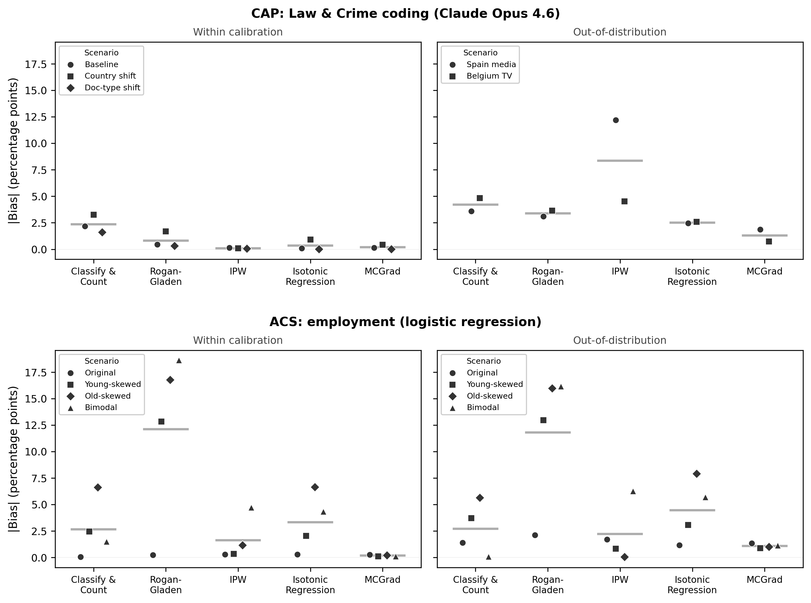

^1^Meta Platforms Inc., ^2^The London School of Economics and Political Science

## Abstract

Political scientists increasingly use classifiers, and now large language models (LLMs), to estimate how prevalent a concept is in a corpus, such as topics in legislative agendas or categories in open-ended survey responses. Standard validation reports discriminative metrics such as accuracy or the area under the ROC curve (AUC) on a labeled sample. This certifies neither valid prevalence estimates in the validated population nor transportability to new ones. Because discrimination depends only on how a model ranks documents, it is blind to the feature-conditional errors that bias a prevalence estimate. Existing corrections either assume label shift or must be re-estimated for every target. We show that *multicalibration*, calibration conditional on input features rather than on average, is sufficient for unbiased prevalence estimation under any covariate shift along the calibrated features, and needs to be fitted only once. We demonstrate this in a simulation and in two applications, an LLM coding policy topics across four countries and languages, and a logistic regression predicting employment from survey data. Multicalibration holds near-zero bias under shift.

# Introduction

Machine learning classifiers, and increasingly large language models (LLMs), have become standard tools to estimate the prevalence of a concept in political text corpora [@baumgartner2006cap; @benoit2026llm; @overos2024protest; @kinglowe2003automated; @weidmann2026democracy; @mellon2024survey; @gilardi2023chatgpt; @ornstein2025parrot]. The quantity of interest is usually not the label on any single document but an *aggregate* count or prevalence [@gonzalez2017review; @hopkinsking2010nonparametric].

The standard way to validate such a classifier is to measure how well it discriminates: how closely its labels agree with human codes, reported as accuracy, $F_1$, or the area under the ROC curve (AUC) and judged against the intercoder reliability of the human benchmark [@halterman2025codebook; @hayeskrippendorff2007answering]. For prevalence estimation this is not sufficient, for two related reasons. First, discrimination does not imply an unbiased prevalence estimate even on the population the classifier was validated on. A classifier can rank documents almost perfectly yet misstate the proportion that are positive, because its false positives and false negatives need not cancel. The quantification literature corrects this, adjusting the raw count with error rates estimated on the labeled sample [@gonzalez2017review].

Second, that correction is tied to the population it was estimated on. When the same instrument is applied to a new target, for example to compare sub-corpora or track a quantity over time, it no longer holds in general. This is due to covariate shift. Across targets, the mix of documents changes (languages, venues, eras, authors) while the rule linking content to category stays fixed (e.g., through the codebook). When a target holds more of the cases the classifier misjudges, errors that canceled on the validation sample no longer do. Classical quantifiers assume the opposite. Under label shift, documents of a category look the same everywhere and only their overall frequency changes, which rarely holds across languages and venues. A high AUC does not protect against this, and standard validation will not reveal it [@adcockcollier2001measurement].

Existing tools each address part of the problem, but none yields a *reusable* instrument. Quantification methods estimate prevalence from imperfect classifiers [@gonzalez2017review], but Classify \& Count, its bias-corrected relatives [@rogan1978estimating; @saerens2002adjusting; @maletzke2018quantification], and the classifier-free ReadMe family [@hopkinsking2010nonparametric; @jerzakkingstrezhnev2023improved] all assume label shift, and so do not transport under covariate shift. Design-based supervised learning [@egami2023dsl], prediction-powered inference [@angelopoulos2023prediction], and importance weighting [@shimodaira2000improving; @sugiyama2007direct] apply under covariate shift but must be re-estimated for each target. A related literature on learned proxies [@knoxlucascho2022proxies] and the reliability of LLM annotations [@bisbee2024synthetic; @argyle2023outofone; @rodriguezspirling2022embeddings] raises the same worry that imperfect measures distort inference; @weidmann2026democracy find LLM classifiers deviate from experts in systematic, feature-dependent directions that conditioning on features can correct.

The simplest model-based prevalence estimator just averages the model's outputs (scores or labels). Such an estimator is unbiased only if the classifier is *calibrated*, that is, if its outputs can be interpreted as predicted probabilities that match empirical frequencies in the population at hand. Calibration, however, is a property of one population and need not survive a shift. Empirically, it degrades under covariate shift even when accuracy is preserved [@yang2023calibration; @ren2025predicting]. Confidence elicitation [@tian2023verbalized; @kadavath2022language; @wang2023selfconsistency] and post-hoc recalibration [@calibrateextrapolate2024] aim only at this global calibration. We show that *multicalibration*, calibration conditional on the input features rather than on average [@hebertjohnson2018multicalibration; @detommaso2024mcllm], fills this gap. A multicalibrated classifier is stable under reweighting of those features. Calibrated once on a labeled source sample, it returns unbiased prevalence estimates on any target whose shift the features capture and that lies within their support [@kim2022universal].

# Prevalence Bias Reduction through Multicalibration

Consider a binary outcome $Y \in \{0,1\}$, features $X$, and a predictor $h(X)\in[0,1]$. The estimand is the prevalence $\pi^*=P^*(Y=1)$ in a target population, estimated by averaging predictions over unlabeled target observations. We assume *covariate shift*: $P(X)$ may differ between source and target, while $P(Y\mid X)$ remains stable. We also require overlap: any region of the feature space that can occur in the target must also occur in the source. Covariate shift contrasts with *label shift*, which instead holds $P(X\mid Y)$ fixed while the prevalence of $Y$ changes.\footnote{The causal heuristic behind these invariance assumptions traces to @scholkopf2012causal; we rely on the invariance, not the causal direction.} Under concept drift, where $P(Y\mid X)$ changes, target prevalence cannot generally be recovered without target labels or additional identifying assumptions.

Global calibration is sufficient for unbiased prevalence estimation in a given population. If $\mathbb{E}[Y\mid h(X)=p]=p$ for every prediction value $p$, then $\mathbb{E}[h(X)]=\mathbb{E}[Y]$. But global calibration in the source population need not survive a change in the distribution of $X$. To see why, partition the population into feature-defined groups $G$ with weights $w_G$, and let $\epsilon_G=\mathbb{E}[h(X)-Y\mid X\in G]$ be the mean signed error in group $G$. If the target changes only the relative sizes of these groups, its population prevalence error is
$$\mathbb{E}^*[h(X)] - \pi^* = \sum_G w_G^*\, \epsilon_G.$$
Global calibration in the source population requires only that the source-weighted errors cancel. When the group weights change, the same errors need not cancel in the target.

Discriminative performance does not prevent this problem. AUC and other rank-based metrics are invariant to strictly increasing transformations of the scores, even though such transformations can substantially change prevalence estimates. Accuracy and $F_1$ are not rank-invariant, but they measure unsigned classification performance rather than the signed errors relevant to an aggregate proportion. A classifier can therefore perform well overall while making systematic errors in a group that is rare in the source and common in the target.

Existing corrections rely on different stability conditions. Rogan-Gladen transports source estimates of sensitivity and specificity; SLD and related methods assume prior shift and valid source posteriors; and ReadMe relies on stability of class-conditional feature distributions [@rogan1978estimating; @saerens2002adjusting; @hopkinsking2010nonparametric]. Global recalibration assumes that the score--outcome relationship transports [@calibrateextrapolate2024]. Importance weighting instead estimates a target-specific density ratio [@shimodaira2000improving; @sugiyama2007direct].

Multicalibration removes these group-level errors rather than relying on their cancellation. Let $\mathcal{G}$ contain all groups that can be formed from the calibrated features, including their interactions and intersections. A predictor $f$ is multicalibrated with respect to $\mathcal{G}$ if $\mathbb{E}[Y\mid f(X)=v,\,X\in G]=v$ for every $G\in\mathcal{G}$ and prediction value $v$ [@hebertjohnson2018multicalibration]. Averaging over prediction values shows that $f$ has zero mean signed error within every group in $\mathcal{G}$. A target shift is captured by $\mathcal{G}$ if it can be expressed as a reweighting of these groups. Because each group error is zero, changing their weights cannot create aggregate error. Under covariate shift and overlap,\footnote{Formally, the result holds when the target-to-source density ratio lies in the linear span of the indicators for groups in $\mathcal{G}$; see SI Section S1.8.}
$$\mathbb{E}^*[f(X)]=\mathbb{E}^*[Y]=\pi^*.$$
This is the @kim2022universal "universal adaptability" guarantee. The same source-fitted predictor can therefore be reused for every target shift captured by the calibrated features, without estimating a new correction for each target.

This is an exact population result. With finite calibration data, multicalibration holds only approximately, and remaining target error depends on the residual calibration error and how well the calibrated features capture the target shift. Whether covariate shift and this representation condition are plausible requires substantive judgment. Overlap can be diagnosed, though not generally certified, using unlabeled target data. We obtain the corrected predictor using MCGrad [@tax2026mcgrad], a post-hoc gradient-boosting multicalibrator.

# Simulation

We first illustrate the mechanism in a setting simple enough to verify by hand. We generate synthetic data with a binary covariate $X\in\{0,1\}$ and outcome $Y$ with $P(Y=1\mid X=1)=0.85$ and $P(Y=1\mid X=0)=0.15$. A classifier produces deterministic, systematically biased scores (a 10% multiplicative bias within each stratum, so $\hat p=0.135$ when $X=0$ and $\hat p=0.935$ when $X=1$). We then estimate prevalence on target distributions with $P(X=0)$ ranging from 0.01 to 0.99, holding all calibration parameters fixed at their training values, over 50 replications.

{width=88%}

*Figure 1. Relative prevalence bias under covariate shift (50 runs). The x-axis is the change in $P(X=0)$ from the training value of 0.5. Classify \& Count and Rogan-Gladen diverge with shift; global recalibration shows moderate bias; the multicalibrated estimator stays near zero. Cropped at $\pm40\%$; the full range, additional methods, and RMSE are in SI Sections S4--S5.*

At the training distribution ($\Delta P(X=0)=0$) every method is approximately unbiased (Figure 1). As the target shifts, they diverge. Classify \& Count and Rogan-Gladen grow with the shift, the latter's ratio form amplifying the error beyond $\pm40\%$. Global recalibration shows moderate but nonzero bias, up to roughly 15% at the most extreme shift. Only the multicalibrated estimator stays near zero throughout. The estimators in Figure 1 differ only in how it turns the classifier's scores into a prevalence; all share the same ranking of $X$, and so have identical discriminative performance.

# Applications

We demonstrate the mechanism on two applications with known ground truth. The first is an LLM coding political text. We use Claude Opus 4.6\footnote{An open-weights replication with Llama 3.3 70B (SI Section S2) confirms the findings and permits full reproduction.} to classify 30,000 Comparative Agendas Project texts [@baumgartner2006cap] for whether they concern Law \& Crime (CAP major topic 12), scored against the published expert codes. The documents span six sub-populations across four countries and languages, 5,000 each. Law \& Crime is a rare topic, coded in 7.9\% of documents at baseline and 6--20\% across scenarios. The second is an ordinary logistic regression predicting employment from 16 sociodemographic features in American Community Survey (ACS) microdata. In both, we construct targets whose covariate shift is known by design: within-support reweightings (of countries and document types; of age groups) and out-of-support targets (unseen document types; held-out states). The LLM is prompted for both a Yes/No classification and an elicited probability $P(\text{Yes})$ [@tian2023verbalized; @kadavath2022language]. We multicalibrate on the bare Yes/No label, the output essentially all applied studies produce, and reserve the probability for the methods that require a score. Designs, feature sets, and full numbers are in SI Sections S2--S3.

{width=100%}

*Figure 2. Absolute prevalence bias (percentage points) by method and scenario. Top: CAP Law \& Crime coding with Claude Opus 4.6, multicalibrated on the Yes/No label. Bottom: ACS employment with logistic regression. Left: targets within the calibration support; right: out-of-distribution targets. Marker shape denotes scenario, horizontal bars are scenario means, and all panels share one scale. Full numbers in SI Tables S1--S2.*

In the political-text application the LLM clears any discriminative-validation bar, with per-language AUC of 0.98--0.99, yet Classify \& Count, the applied default, is biased by +1.6 to +4.8pp (Figure 2, top), a relative overstatement of nearly 30\% at baseline and over 40\% at its worst. Rogan-Gladen reduces this within support but still misses by +3.1 to +3.7pp out of support. SLD, the label-shift quantifier, is already biased at baseline (+7.4pp, since the elicited scores are not the calibrated posteriors its EM step assumes) and reaches +21.6pp out of support, confirming that the label-shift family does not transport under covariate shift.\footnote{ReadMe [@hopkinsking2010nonparametric], the canonical political-science quantifier, is classifier-free and fails as the label-shift diagnosis predicts, exceeding +60pp under some shifts; details and ReadMe2 [@jerzakkingstrezhnev2023improved] in SI Section S7 (Table S4).} Isotonic recalibration of the scores is accurate within support ($\le 0.9$pp) but drifts out of it (+2.6pp on Belgian TV, $-2.5$pp on Spanish media). Inverse probability weighting (IPW) is near-zero within support and fails out of it ($-12.2$pp), where the target contains feature values absent from the source (a positivity violation). Multicalibration on the bare Yes/No labels achieves near-zero bias within support ($\le 0.4$pp) and degrades gracefully out of support (+0.7pp on Belgian TV, $-1.9$pp on Spanish media). Feeding it the elicited probabilities instead performs comparably within support and somewhat worse out of it (SI Table S2), because the correction comes from the metadata features and the calibration sample, not from the quality of the model's confidences.

The survey application reproduces this ordering with a wider spread (Figure 2, bottom). Rogan-Gladen and SLD fail by 12--19pp under the age shifts. Classify \& Count and isotonic regression stay closer but grow with the shift, reaching 6--8pp at the largest ones. IPW is accurate on the simple age shifts ($\le 1.2$pp) but breaks on the bimodal one (+4.7pp), where the density ratio is hard to model. Multicalibration stays at $\le 0.27$pp across every within-support target, including the bimodal shift, and at 0.88--1.35pp on held-out states. Read together, the two applications locate the condition under which global recalibration is sufficient: it works when the predictor's errors are roughly homogeneous across the groups a shift reweights, which the CAP shifts approximately satisfy. The ACS shifts move age, which drives employment hard (76\% employed at ages 25--54 against 17\% at 65+), so group errors are large and heterogeneous, and only feature-conditional calibration removes them.

# Discussion

Prevalence estimation across populations is a common goal in political science research. With LLMs becoming more popular, even more zero-shot, model-based measurement of prevalence is being unlocked. Discriminative validation shows only that a classifier separates classes. It is silent on whether the resulting prevalence estimates are unbiased, either in the population where discrimination was validated or in any other. In our LLM application a classifier with per-language AUC above 0.98 still produced default prevalence estimates off by roughly 30--40\% of the true rate, even without shift and worse under it, and would have passed any discriminative check while misreporting prevalence. Multicalibration, calibration conditional on features rather than on average, removes this bias where discrimination was validated and keeps it removed as the target shifts.

However, the guarantee has limits. It holds only along calibrated dimensions, so calibration data must span the anticipated variation. It also requires labeled calibration data, which in zero-shot settings reintroduces some hand-coding, though far less than per-document labeling and only once. Under mixtures the covariate-shift condition holds only approximately. Our applications have ground truth, so we can verify the estimates directly; a practitioner usually cannot, since the target's labels are what is missing.

# References
