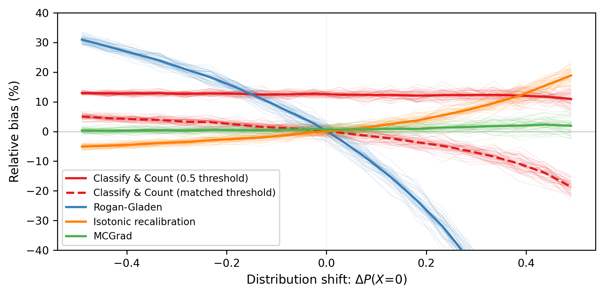
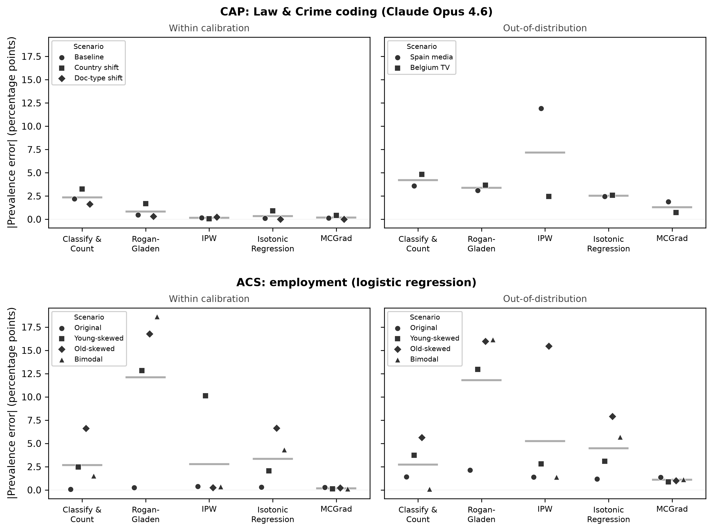

^1^Meta Platforms Inc., ^2^The London School of Economics and Political Science

Corresponding author: Fridolin Linder (flinder@meta.com)

## Abstract {.unnumbered}

Political scientists increasingly use classifiers, including large language models (LLMs), to estimate how prevalent a concept is in a corpus. Standard validation reports discriminative metrics such as accuracy or the area under the ROC curve (AUC) on a labeled sample. This certifies neither unbiased prevalence estimates in the validated population nor their transport to new ones. Existing prevalence corrections either rely on label-shift assumptions or must be re-estimated for every target. Building on @kim2022universal, we show that a *multicalibrated* classifier, one calibrated conditional on input features rather than only on average, yields unbiased prevalence estimates under any covariate shift that the calibrated groups can express, within their support, and needs to be fitted only once. In a simulation and two applications, an LLM coding policy topics across four countries and languages and a logistic regression predicting employment from survey data, multicalibration keeps prevalence error below half a percentage point for shifts within the calibrated features, where standard corrections miss by around 20 points, and degrades only modestly beyond them.

**Keywords:** prevalence estimation, multicalibration, covariate shift, quantification, large language models, measurement validity

# Introduction

Machine learning classifiers, and increasingly large language models (LLMs), have become standard tools for coding political text [@benoit2026llm; @overos2024protest; @mellon2024survey; @gilardi2023chatgpt; @ornstein2025parrot]. The quantity of interest is usually not the label on any single document but an *aggregate* count or prevalence [@gonzalez2017review; @hopkinsking2010nonparametric].

The standard way to validate such a classifier is to measure how well it classifies documents or agrees with human coders, using metrics such as accuracy, $F_1$, AUC or intercoder reliability [@halterman2026codebook; @hayeskrippendorff2007answering]. For prevalence estimation this is not sufficient. First, a classifier can rank documents almost perfectly yet misstate the proportion that are positive, because its false positives and false negatives need not cancel. The quantification literature corrects this with error rates estimated on the labeled sample [@gonzalez2017review]. Second, corrections are tied to the population they were estimated on. When the instrument is applied to a new target, for example to compare sub-corpora or track a quantity over time, the mix of instances or documents might change, i.e. covariates shift. If the target holds more of the cases the classifier misjudges, errors that canceled on the validation sample no longer do. That is, validity established in one context need not hold in another [@adcockcollier2001measurement].

Existing methods each address part of the problem, but none yields a *reusable* instrument. Classify \& Count takes the classifier's labels at face value. Its adjusted relatives [@rogan1978estimating; @saerens2002adjusting] and the classifier-free ReadMe family [@hopkinsking2010nonparametric; @jerzakkingstrezhnev2023improved] instead carry class-conditional quantities, such as error rates or word profiles within each category, from the labeled sample to the target. That is justified under label shift, where only category frequencies change [@tasche2023invariance], but covariate shift generally changes those quantities [@tasche2022covariate]. Design-based supervised learning [@egami2023dsl] and prediction-powered inference [@angelopoulos2023prediction] require gold labels drawn from the population being analyzed, or, for the latter, a label shift or known covariate-shift weights linking the two. Importance weighting [@shimodaira2000improving; @sugiyama2007direct; @tasche2023invariance] shares the covariate-shift assumption but must be re-estimated for each target, and it sets the classifier aside: its estimate is a reweighted average of hand codes, with nothing to reweight where the target sample is outside the source's support. Related work on learned proxies [@knoxlucascho2022proxies] and on LLMs as annotators [@ziems2024llmcss] or proposed substitutes for survey respondents [@argyle2023outofone; @bisbee2024synthetic] raises the same worry that imperfect measures distort inference; @weidmann2026democracy find that LLM coders deviate from experts in systematic directions.

Averaging a model's outputs gives an unbiased prevalence estimate if the classifier is *calibrated*, that is, when its outputs match empirical frequencies in the population at hand. For example, @calibrateextrapolate2024 calibrate classifier outputs on a labeled sample and extrapolate to the target by assuming a stable calibration curve. But calibration is a property of one population. When the classifier's errors vary with the features, a shift in these features that the score does not capture changes what a given score means, so the calibration curve can move [@tasche2022covariate]. Building on @kim2022universal, we argue that *multicalibration*, calibration within each of a rich class of subgroups defined by the input features [@hebertjohnson2018multicalibration], can address this concern. A model, multicalibrated once on a labeled source sample, returns unbiased prevalence estimates on any target whose shift the features capture and that lies within their support.

# Prevalence Bias Reduction through Multicalibration

Consider a binary outcome $Y \in \{0,1\}$, features $X$, and a predictor $h(X)\in[0,1]$. The estimand is the target prevalence $\pi^*=P^*(Y=1)$, estimated by averaging predictions over unlabeled target observations. We assume *covariate shift*: $P(X)$ may differ between source and target while $P(Y\mid X)$ is stable, in contrast to *label shift*, which holds $P(X\mid Y)$ fixed. We also require overlap: any feature region that occurs in the target also occurs in the source. Under concept drift, where $P(Y\mid X)$ changes, target prevalence cannot generally be recovered without target labels.

Global calibration is sufficient for unbiased prevalence estimation in a given population: if $\mathbb{E}[Y\mid h(X)=p]=p$ for every prediction value $p$, then $\mathbb{E}[h(X)]=\mathbb{E}[Y]$. But it need not survive a change in the distribution of $X$. Partition the population into feature-defined groups $G$ with weights $w_G$, and let $\epsilon_G=\mathbb{E}[h(X)-Y\mid X\in G]$ be the mean signed error in group $G$. If the target changes only the group weights, its prevalence error is $\mathbb{E}^*[h(X)] - \pi^* = \sum_G w_G^*\epsilon_G$. Global calibration in the source requires only that the source-weighted errors cancel; under the target weights they need not.

This illustrates why discriminative performance does not guard against this form of bias. E.g., AUC is invariant to monotone transformations of the scores, which can change prevalence estimates substantially, and accuracy and $F_1$ measure unsigned rather than signed errors. A classifier can therefore perform well overall while erring systematically in a group that is rare in the source and common in the target.

Multicalibration removes these group-level errors rather than relying on their cancellation. Let $\mathcal{G}$ contain all groups that can be formed from the calibrated features, including their interactions and intersections. A predictor $f$ is multicalibrated with respect to $\mathcal{G}$ if $\mathbb{E}[Y\mid f(X)=v,\,X\in G]=v$ for every $G\in\mathcal{G}$ and prediction value $v$ [@hebertjohnson2018multicalibration]. Averaging over prediction values shows that $f$ has zero mean signed error within every group in $\mathcal{G}$. A target shift is captured by $\mathcal{G}$ if it can be expressed as a reweighting of these groups. Because each group error is zero, changing their weights cannot create aggregate error. Under covariate shift and overlap,
$$\mathbb{E}^*[f(X)]=\mathbb{E}^*[Y]=\pi^*.$$
This is the "universal adaptability" guarantee of @kim2022universal, who show that such an estimate is as accurate as inverse propensity weighting, up to the multicalibration error, under any propensity model whose odds the group class can express.\footnote{Note that technically, *multi-accuracy*, zero mean error within each group, already suffices. We discuss this in more detail in SI Section S1.8.} The same predictor serves every target shift the calibrated features capture, without a new correction per target and without target labels.

This guarantee is exact only when the target-to-source density ratio lies in the span of the group indicators. Otherwise it is approximate, with error governed by how well the calibrated groups approximate that ratio; with finite calibration data, multicalibration itself also holds only approximately. Whether covariate shift and this representation condition are plausible requires substantive judgment. Overlap can be diagnosed, though not generally certified, using unlabeled target data. We obtain the multicalibrated predictor using MCGrad [@tax2026mcgrad], a post-hoc gradient-boosting multicalibrator.

# Simulation

We first illustrate the mechanism with a simple simulation. We use a binary feature $X$ and a continuous signal $U\sim N(0,1)$. The outcome model $P(Y=1\mid X,U)=\sigma(a_X+1.5\,U)$ is the same in every population. The classifier's score adds a logit offset for $X=0$ only to simulate miscalibration, so it overstates this group's probability while still discriminating well (AUC $\approx0.89$). Each estimator is fit on 10,000 labeled samples at $P(X=0)=0.5$ and applied to unlabeled targets with $P(X=0)$ from 0.01 to 0.99, over 50 repetitions. We compare multicalibration (MCGrad) to the classify and count baseline as well as the canonical Rogan-Gladen adjustment and global recalibration (Isotonic Regression). Additional details can be found in SI Section S4.

{width=88%}

*Figure 1. Relative prevalence bias under covariate shift, against the change in $P(X=0)$ from its calibration value of 0.5. Faint lines are individual runs; thick lines are the average over 50 runs. The figure is cropped at $\pm40\%$. The full range, all methods, and RMSE can be found in SI Sections S4--S5.*

At the calibration distribution ($P(X=0)=0.5$), Classify \& Count with the default 0.5 threshold overstates prevalence by about 12\%: good discrimination does not make the counts accurate. The labeled sample can remove this bias in three common ways: by choosing the threshold so that the count reproduces the calibration prevalence, by adjusting the count for the estimated error rates (Rogan-Gladen), or by recalibrating the scores (isotonic regression). All three are unbiased at the calibration distribution, but each fits a single correction to the calibration mix of $X$, and the correction fails when that mix changes: the matched-threshold count drifts to about $-19\%$, and Rogan-Gladen, whose ratio form amplifies changes in the error rates, exceeds $\pm30\%$. Isotonic recalibration shows the mechanism most clearly: it maps a score to the same probability whatever the document's $X$, which is too high for $X=0$ documents and too low for $X=1$. These errors cancel only at the calibration mix, so the bias grows to about $+19\%$ when nearly all documents have $X=0$. MCGrad is fitted to the same labeled sample and the same scores, but it calibrates within each value of $X$, so its correction holds under shift: its average bias stays within about 2\% throughout. The 0.5-threshold count, finally, is wrong everywhere; its bias barely moves only because its relative error happens to be similar in the two groups here.

# Applications

We apply the method in two settings with known ground truth. First, Claude Opus 4.6\footnote{An open-weights replication with Llama 3.3 70B (SI Section S2) reproduces the qualitative pattern and permits full reproduction.} classifies 29,900 Comparative Agendas Project texts [@baumgartner2006cap] from six sub-populations in four countries and languages for whether they concern Law \& Crime (CAP major topic 12), scored against the expert codes. The topic is rare: 7.9\% at baseline and 6--20\% across scenarios. Second, a logistic regression predicts employment from 16 sociodemographic features in American Community Survey (ACS) microdata. In both, the targets' covariate shift is known by design: within-support reweightings (of countries and document types; of age groups) and out-of-support targets (unseen document types; held-out states). The LLM returns a Yes/No label and an elicited probability [@tian2023verbalized]. We multicalibrate on the bare label, the output nearly all applied studies use, and give the probability to the methods that require a score. Details are in SI Sections S2--S3.

{width=100%}

*Figure 2. Absolute prevalence error (percentage points) by method and scenario. Top: CAP Law \& Crime coding with Claude Opus 4.6, multicalibrated on the Yes/No label. Bottom: ACS employment with logistic regression. Left: within-support targets; right: out-of-distribution targets. Markers denote scenarios and bars their means. Full numbers in SI Tables S1--S2.*

The LLM clears any discriminative bar (per-language AUC about 0.98), yet Classify \& Count, the applied default, errs by +1.6 to +4.8pp (Figure 2, top), overstating prevalence by nearly 30\% at baseline. Rogan-Gladen reduces this within support but misses by +3.1 to +3.7pp out of it. SLD, run on isotonic-recalibrated scores, is accurate at baseline (+0.1pp) but drifts to +3.8 to +4.7pp out of support, worse than isotonic recalibration alone, because it attributes the covariate shift to a change in the class prior.\footnote{ReadMe [@hopkinsking2010nonparametric], the best-known political-science quantifier, is classifier-free and fails as the label-shift diagnosis predicts, exceeding +60pp under some shifts (SI Section S7).} Isotonic recalibration is accurate within support ($\le 0.9$pp) but drifts out of it (up to 2.6pp). IPW, with a gradient-boosted propensity model on the multicalibration features, is near zero within support but misses by $-11.9$pp on Spanish media, whose feature values are absent from the source. Multicalibration on the bare labels stays within 0.4pp within support and 1.9pp out of it. Feeding it the elicited probabilities performs comparably within support and somewhat worse out of it (SI Table S2): the correction comes from the features and the calibration sample, not from the model's confidences.

The survey application reproduces this ordering with a wider spread (Figure 2, bottom). Rogan-Gladen and SLD fail by 12--19pp under the age shifts, and Classify \& Count and isotonic regression reach 6--8pp at the largest. IPW, using the same learner as MCGrad without tuning, is accurate on most targets but collapses on two ($-10.1$ and $-15.5$pp): with a calibration sample thirty times larger than the target, a few source observations receive extreme weights (SI Section S3). Multicalibration stays within 0.27pp on every within-support target and 0.88--1.35pp on held-out states. Global recalibration thus suffices only when the predictor's errors are roughly homogeneous across the groups a shift reweights, as approximately in CAP. The ACS shifts move age, which drives employment (76\% employed at ages 25--54, 17\% at 65+), so group errors are large and heterogeneous, and only feature-conditional calibration removes them.

# Discussion

Discriminative validation shows only that a classifier separates classes. It is silent on whether the resulting prevalence estimates are unbiased, in the validated population or any other: in our LLM application, counting the labels of an LLM whose probabilities reach a per-language AUC of about 0.98 overstated prevalence by 18--44\% of the true rate. Multicalibration removes this bias where the classifier was validated and keeps it removed as the target shifts. Unlike importance weighting, it is fitted once, before any target is seen, and yields a single instrument for a time series or a set of sub-corpora without target labels or per-target re-estimation.

However, the guarantee has limits. It holds only along calibrated dimensions, so calibration data must span the anticipated variation. It also requires labeled calibration data, which in zero-shot settings reintroduces some hand-coding, though far less than per-document labeling and only once. Under mixtures the covariate-shift condition holds only approximately. Our applications have ground truth, so we can verify the estimates directly; a practitioner usually cannot, since the target's labels are what is missing.

# Funding {.unnumbered}

This research was conducted as part of the authors' employment at Meta Platforms, Inc. and received no specific external funding.

# Acknowledgements {.unnumbered}

The authors used Claude Opus 4.6, Claude Opus 4.7, and Gemini 3 Pro to assist with literature search, code, data analysis, visualization, and drafting and editing of the manuscript; the full declaration is in SI Section S9. The authors are entirely responsible for the scientific content of the paper, which adheres to the journal's authorship policy. The Belgian data for the period of 1988-2011 were collected by Stefaan Walgrave and his collaborators (Jeroen Joly, Anne Hardy, Brandon Zicha, Julie Sevenans, and Tobias Van Assche). Funding came from the European Science Foundation (grant number: 07-ECRP-008), from the Flemish National Science Foundation (grant number: G.0117.11N) and from the Belgian Federal Science Policy (grant number: IUAP P7/46). The Belgian data for the period of 2011-2024 were collected by Stefaan Walgrave and Yannick L\'eonard. The Funding was provided by the TOP BOF University of Antwerp Grant (grant number FFB210426). The original collectors of the data do not bear any responsibility for the analysis reported here. The data in the Danish Policy Agenda Project have been collected by Christoffer Green-Pedersen and Peter B. Mortensen with support from the Danish Social Science Research Council and the Research Foundation at Aarhus University. The Spanish data were originally collected by Laura Chaqu\'es-Bonafont, Anna M. Palau and Luz M. Mu\~noz, with the collaboration of graduate students and the financial support of the Spanish Ministry of Innovation and Science and the Ag\`encia de Gesti\'o d'Ajuts Universitaris i de Recerca (AGAUR). Neither these public institutions nor the original collectors of the data bear any responsibility for the analysis reported here.

# Competing Interests {.unnumbered}

All authors are employees of Meta Platforms, Inc.; Milan Vojnovic is also affiliated with the London School of Economics and Political Science. Niek Tax, Lorenzo Perini, Fridolin Linder, Daniel Haimovich, and Milan Vojnovic are authors of MCGrad [@tax2026mcgrad], the open-source multicalibration method evaluated here. The authors declare no other competing interests.

# Data Availability Statement {.unnumbered}

Replication code and data will be deposited in the Political Analysis Dataverse and are available at <https://github.com/facebookresearch/multicalibrated_llm_measurement>. The analyses use Comparative Agendas Project datasets [@capdata], including the U.S. Congressional Bills data [@wilkerson2025bills], coded under the CAP master codebook [@jones2025codebook], and American Community Survey microdata [@census2018acspums], accessed through the folktables package [@ding2021retiring].

# References {.unnumbered}
