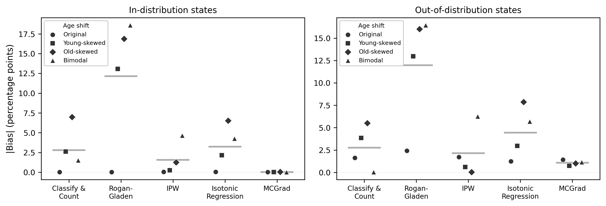
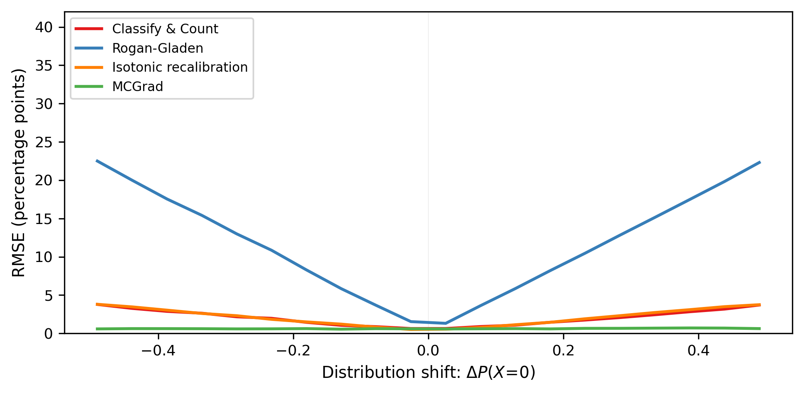
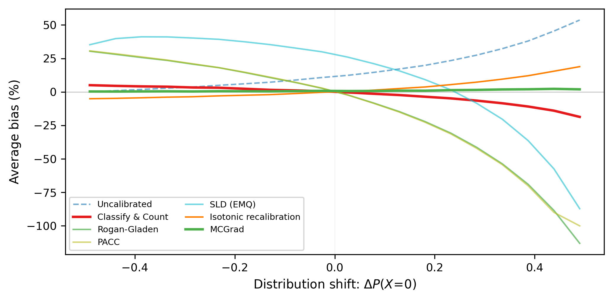
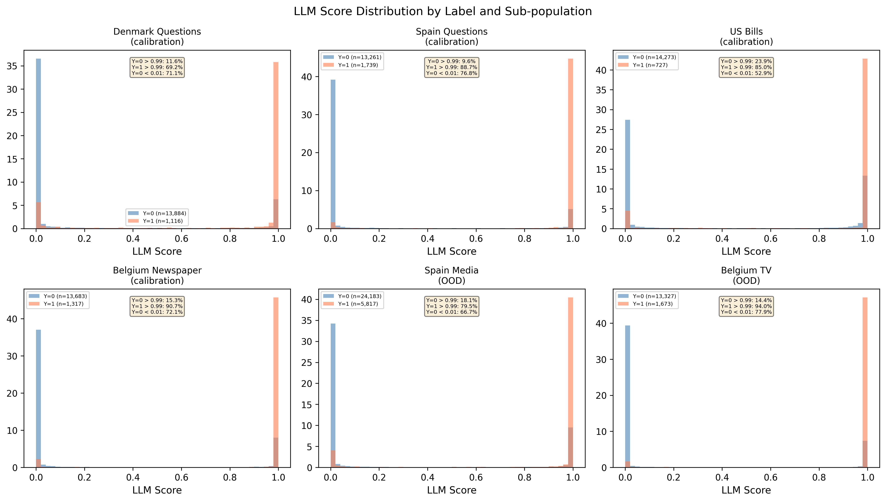

# SI Appendix

## S1. Formal Definitions of Prevalence Estimation Methods

This section defines the prevalence estimation methods used in the simulation and the applications. The simulation compares seven of them (Figure S2); main-text Figure 1 shows four.

**Setup.** Let $h(X) \in [0,1]$ denote the device's probabilistic prediction for input $X$, with true label $Y \in \{0,1\}$. The goal is to estimate the target prevalence $\pi^* = P^*(Y=1)$ using only unlabeled target data $\{X_i^*\}_{i=1}^n$ and calibration parameters estimated from a labeled source dataset.

### S1.1 Uncalibrated Averaging

$$\hat{\pi}_{\text{raw}} = \frac{1}{n} \sum_{i=1}^n h(X_i^*)$$

### S1.2 Classify & Count

Given a threshold $\tau$ chosen on calibration data:
$$\hat{\pi}_{\text{CC}} = \frac{1}{n} \sum_{i=1}^n \mathbf{1}[h(X_i^*) \geq \tau]$$

In the simulation, $\tau$ is the score quantile at which $\hat{\pi}_{\text{CC}}$ matches the true prevalence on the calibration set.

### S1.3 Rogan-Gladen (Adjusted Count)

$$\hat{\pi}_{\text{RG}} = \frac{\hat{\pi}_{\text{CC}} - \widehat{\text{FPR}}}{\widehat{\text{TPR}} - \widehat{\text{FPR}}}$$

where $\widehat{\text{TPR}}$ and $\widehat{\text{FPR}}$ are estimated from calibration data at threshold $\tau$ [@rogan1978estimating].

### S1.4 Probabilistic Adjusted Classify & Count (PACC)

$$\hat{\pi}_{\text{PACC}} = \frac{\bar{h} - \hat{\mu}_0}{\hat{\mu}_1 - \hat{\mu}_0}$$

where $\bar{h} = \frac{1}{n}\sum_i h(X_i^*)$, $\hat{\mu}_1 = \hat{\mathbb{E}}[h(X)|Y=1]$, and $\hat{\mu}_0 = \hat{\mathbb{E}}[h(X)|Y=0]$ are estimated from calibration data [@gonzalez2017review].

### S1.5 SLD (EMQ)

The Saerens-Latinne-Decaestecker algorithm iterates:

1. Initialize $\hat{\pi}^{(0)}$ from the source prevalence.
2. E-step: Adjust posteriors for the new prior:
$$\tilde{h}_i^{(t)} = \frac{(\hat{\pi}^{(t)} / \pi_s) \cdot h(X_i^*)}{(\hat{\pi}^{(t)} / \pi_s) \cdot h(X_i^*) + ((1-\hat{\pi}^{(t)}) / (1-\pi_s)) \cdot (1 - h(X_i^*))}$$
3. M-step: $\hat{\pi}^{(t+1)} = \frac{1}{n}\sum_i \tilde{h}_i^{(t)}$
4. Repeat until convergence [@saerens2002adjusting].

### S1.6 Global Calibration

Global calibration fits a monotone map $m$ from scores to probabilities by isotonic regression of $Y$ on $h(X)$ in the calibration data, and estimates $\hat{\pi}_{\text{iso}} = \frac{1}{n}\sum_i m(h(X_i^*))$. The same estimator is used in the simulation and in both applications. Because $m$ depends on the score alone, it is calibrated at the calibration sample's feature mix but not within feature-defined groups whose scores overlap.

### S1.7 Multicalibration

In the simulation and in both empirical applications, we use MCGrad [@tax2026mcgrad], a multicalibration algorithm based on gradient boosting. MCGrad operates in logit space: given a base predictor $f_0(X)$ with logit $F_0(X) = \text{logit}(f_0(X))$, it iteratively fits gradient boosted decision trees (GBDTs) on the residuals between labels and current predictions. At each round $t$, a GBDT $g_t$ is trained with the current logit predictions as `init_score` and with the feature matrix consisting of the segment features (categorical and numerical) augmented by the current logit prediction as an additional input feature. The logit predictor is then updated as $F_{t+1}(X) = \alpha_t \cdot (F_t(X) + g_t(X))$, where $\alpha_t$ is a single scalar unshrinkage factor estimated by a one-parameter logistic regression of the labels on the combined logit $F_t(X) + g_t(X)$, applied to the full running logit rather than to the increment alone. Because $\alpha_t$ is fit to maximize fit of the combined logit to the labels at each round, it counteracts the shrinkage induced by the GBDT learning rate without disturbing the relative structure the trees discovered; @tax2026mcgrad establish that the resulting sequence converges to a multicalibrated predictor. By including the prediction as a feature, GBDT splits naturally discover miscalibrated regions in the joint space of features and score levels, thereby approximating multicalibration without requiring explicit group specification. Early stopping on a validation set prevents overfitting. MCGrad uses LightGBM as the GBDT implementation. See @tax2026mcgrad for convergence results and deployment details. Our claims are algorithm-agnostic: any procedure producing a multi-accurate, a fortiori multicalibrated, predictor over the feature class delivers the same guarantee, and several exist [@hebertjohnson2018multicalibration; @gopalan2022omnipredictors; @detommaso2024mcllm]. An open-source implementation of MCGrad is available at <https://mcgrad.dev>.

### S1.8 Multi-accuracy versus multicalibration

The main text states the universal-adaptability guarantee for a multicalibrated predictor and computes one with MCGrad. The property strictly required for prevalence estimation is weaker. Let $e(X,Y)=f(X)-Y$. A predictor is *multi-accurate* with respect to a group class $\mathcal{G}$ if
$$\mathbb{E}[\mathbf{1}\{X\in G\}e(X,Y)]=0 \qquad \text{for every }G\in\mathcal{G}.$$
This is equivalent to zero mean signed error within every group of positive probability. Multicalibration implies this condition by averaging $\mathbb{E}[Y\mid f(X)=v,X\in G]=v$ over the prediction values $v$ within each group.

Let $P$ and $P^*$ denote the source and target populations, and let $r(X)=dP_X^*/dP_X$ be their density ratio. Under covariate shift and overlap,
$$\mathbb{E}^*[f(X)-Y]=\mathbb{E}[r(X)e(X,Y)].$$
Suppose the target shift is representable by the group class, meaning that for some $G_1,\ldots,G_J\in\mathcal{G}$ and coefficients $a_1,\ldots,a_J$,
$$r(X)=\sum_{j=1}^J a_j\mathbf{1}\{X\in G_j\}.$$
Multi-accuracy then gives
$$
\mathbb{E}^*[f(X)-Y]
=\sum_{j=1}^J a_j\mathbb{E}[\mathbf{1}\{X\in G_j\}e(X,Y)]
=0.
$$
Thus one source-fitted predictor is unbiased for every target whose density ratio lies in the linear span of the calibrated group indicators [@kim2022universal]. For a single fixed target, only the weaker condition $\mathbb{E}[r(X)e(X,Y)]=0$ is necessary.

The same argument gives an approximate result. If a function $g$ in the span of the group indicators approximates $r$, then
$$
\left|\mathbb{E}^*[e(X,Y)]\right|
\leq \left|\mathbb{E}[g(X)e(X,Y)]\right|
+\mathbb{E}[|r(X)-g(X)|],
$$
where the final term uses $|e(X,Y)|\leq1$. The first term reflects remaining multi-accuracy error and the second reflects how well the calibrated group class represents the target shift.

Multicalibration remains the more useful practical target. It also controls calibration within score levels and therefore applies when selection or downstream analysis depends on the model's own scores. MCGrad [@tax2026mcgrad] approximates this property using the feature and score interactions learned by gradient-boosted trees (Section S1.7). Other procedures can provide the same population guarantee if they achieve the required group-level residual balance [@hebertjohnson2018multicalibration; @gopalan2022omnipredictors; @detommaso2024mcllm].

### S1.9 Estimation and implementation details

**Simulation.** The data-generating process is given in the main text: $X\sim\text{Bernoulli}(1-P(X=0))$, $U\sim N(0,1)$ independent of $X$, $P(Y=1\mid X,U)=\sigma(a_X+bU)$ with $a_0=-2$, $a_1=1.5$, $b=1.5$, and classifier score $h=\sigma(a_X+bU+\delta_X)$ with $\delta_0=0.8$, $\delta_1=0$. Each of the 50 runs draws a fresh calibration sample of $n=10{,}000$ at $P(X=0)=0.5$, fits every estimator once, and evaluates bias and RMSE on 20 fresh unlabeled targets of $n=10{,}000$ with $P(X=0)$ evenly spaced in $[0.01,0.99]$. Bias is relative to each target sample's realized prevalence. MCGrad uses $X$ as its single categorical feature with default hyperparameters. Definitions of all seven methods are in Section S1.

**Comparative Agendas Project.** The two campaigns (binary Yes/No and direct probability elicitation) were run separately to avoid anchoring. Benchmark implementations: Rogan-Gladen uses TPR/FPR estimated on the calibration set; IPW estimates density ratios by logistic regression on country, document type, decade, and length; isotonic regression is fit on the scores. Per-scenario bias is in Table S2; the ReadMe comparison is in Section S7 and the Llama 3.3 70B replication in Section S2.

**American Community Survey.** Training states are TX, MI, PA, OH, IL, GA, NC, VA (2016--2018); held-out test states are CA, NY, FL, WA, AZ, CO, with in-distribution test $n\approx 920{,}000$. Age-shifted targets are produced by importance-weighted resampling, and RMSE by a 200-iteration bootstrap. Post-hoc calibration uses isotonic regression and MCGrad with categorical and numerical features.

## S2. Robustness: Replication with Open-Weight LLM (Llama 3.3 70B)

The main text reports results using Claude Opus 4.6 as the LLM measurement device. To verify that the findings are not specific to a particular model, we replicate the CAP analysis using Llama 3.3 70B Instruct [@llama2024herd] (4-bit NF4 quantized, run on a single A100 80GB GPU). This section reports results using two score extraction methods: token log-probabilities and verbalized confidence elicitation.

### S2.1 Score Extraction Methods

**Log-probabilities.** For each document, the model is prompted with the CAP codebook definition of Law & Crime and asked to respond Yes or No. The score is extracted from next-token log-probabilities: $h(X) = P(\text{Yes}) / (P(\text{Yes}) + P(\text{No}))$. This produces highly bimodal scores: 23% of the 105,000 documents score at exactly 0.0 or 1.0, and only 6% fall in the mid-range [0.1, 0.9]. Because MCGrad's internal logit transform maps values near 0 and 1 to $\pm\infty$, a linear squashing transformation $h'(X) = \epsilon + (1 - 2\epsilon) \cdot h(X)$ with $\epsilon = 0.05$ is applied before fitting MCGrad.

**Verbalized confidence (2-stage).** A two-stage dialogue first asks the model to classify the document (Yes/No), then asks it to estimate the probability that its answer is correct, with an anti-certainty instruction ("Note: very few things are 0% or 100% certain") to discourage degenerate outputs [@tian2023verbalized]. The score is $P(\text{correct})$ if the answer is Yes and $1 - P(\text{correct})$ if No. This produces scores in [0.01, 0.99] with negligible boundary mass and 11 unique score values. No squashing is required.

### S2.2 Data and Calibration

The Llama analysis uses the full 105,000-document sample (15,000 per sub-population for Denmark questions, Spain questions, U.S. bills, and Belgium newspaper; 30,000 for Spanish media; 15,000 for Belgian TV). The calibration set ($n \approx 40{,}000$) is drawn equally from the four in-distribution sub-populations. MCGrad is calibrated with categorical features (country, document type, party) and one numerical feature (decade). Because this analysis draws on the larger 105,000-document sample rather than the 30,000-document Opus main-text sample, the expert-coded true prevalences below differ slightly from Table S2 (e.g., 8.1% vs. 7.9% at baseline); these are sampling differences in the gold standard, not discrepancies in the method.

### S2.3 Results: Verbalized Confidence Scores

Table S3 shows prevalence estimation bias using Llama 3.3 70B with verbalized confidence scores.

| Scenario | Shift Type | True Prev. | CC | RG | IPW | Iso. | MCGrad |
|---|---|---|---|---|---|---|---|
| Baseline | None | 8.1% | +14.7 | +0.6 | +0.1 | +0.2 | +0.2 |
| Country shift | Within-cal. | 8.7% | +15.6 | +2.2 | -0.3 | +1.3 | +0.1 |
| Doc-type shift | Within-cal. | 6.5% | +16.0 | +1.7 | +0.0 | +0.7 | +0.1 |
| Spain media | OOD doc type | 19.3% | +15.4 | +6.6 | -9.8 | -7.2 | -4.9 |
| Belgium TV | OOD doc type | 11.1% | +13.3 | -0.0 | -3.5 | -1.6 | -3.4 |

*Table S3: Prevalence estimation bias (pp) for Law & Crime topic using Llama 3.3 70B with verbalized confidence scores. CC = Classify & Count, RG = Rogan-Gladen, IPW = importance-weighted estimation, Iso. = isotonic regression.*

The pattern is consistent with the main text's Claude Opus results: MCGrad achieves near-zero bias within the calibration distribution ($\leq 0.2$pp) and degrades on OOD populations (-3.4 to -4.9pp). Several differences are notable:

- **Higher raw CC bias** (+14-16pp vs. +2-5pp with Opus).
- **Comparable MCGrad within-calibration performance** ($\leq 0.2$pp for both models), confirming that multicalibration corrects for model-specific calibration errors.
- **Larger OOD bias** on Spanish media (-4.9pp vs. Opus's -1.9pp on binary labels / -4.5pp on probability scores), reflecting the combination of a weaker base model with a coarser score distribution. Note that this comparison mixes elicitation modes: the Llama numbers here use verbalized confidence (11 unique values), whereas the Opus main-text headline uses binary labels; the closest like-for-like comparison is Llama verbalized against Opus's probability-score condition (43 unique values, SI Figure S3), and on that comparison the gap is consistent with the finer Opus score distribution. The broader point (that MCGrad's within-calibration performance is near-identical across models and elicitation modes while the input score distribution matters chiefly out of support) holds in every comparison.

### S2.4 Score Distribution: Log-Probabilities vs. Verbalized Confidence

The bimodal distribution of Llama's log-probability scores illustrates a broader challenge for LLM-based measurement. RLHF-tuned instruction-following models tend to produce highly confident outputs, pushing token probabilities toward 0 or 1. This creates two problems for prevalence estimation: (1) the scores carry little information about uncertainty, producing large raw bias even at baseline (+18pp), and (2) post-hoc calibration methods that operate in logit space (including MCGrad) require score preprocessing to avoid numerical instability.

Verbalized confidence elicitation partially addresses both problems by producing scores that are better distributed (75% in [0.1, 0.9]) and better calibrated out of the box (log loss 0.525 vs. 1.707 for log-probabilities). However, the scores remain coarsely discretized (11 unique values), and as shown in both the Llama and Opus analyses, the quality of the input scores matters less than the metadata features for MCGrad's prevalence estimation performance under shift.

### S2.5 Additional Baselines: SLD and PACC on Llama Scores

The SLD (EMQ) algorithm, designed for label shift rather than covariate shift, diverges catastrophically on Llama's verbalized confidence scores, producing prevalence estimates biased by +33 to +60pp. This occurs because the verbalized scores are not calibrated posteriors, violating SLD's core assumption. PACC shows moderate bias (+0.6 to +5.9pp within calibration, +2.4 to +5.9pp OOD). Full results including SLD and PACC are available in the replication code.

## S3. Empirical results: ACS employment benchmark and detailed tables

As a check with exact ground truth, we estimate employment prevalence from American Community Survey microdata via the *folktables* package. The true rate in any subpopulation is known, and the classifier is an ordinary logistic regression rather than an LLM, so this confirms the correction is not specific to language models or to noisy gold labels. We predict employment from 16 sociodemographic features, training on eight states (2016--2018; approximately 1.5M observations) and calibrating on a held-out set ($n\approx 644{,}000$). Because employment rates vary sharply by age (76% for ages 25--54 versus 17% for 65+), we construct covariate shifts by resampling the test set to be young-skewed, old-skewed, or bimodal, yielding true employment rates from 12.8% to 46.0%; all calibration parameters are fixed across scenarios. We evaluate both on in-distribution states and on six held-out states.

{width=100%}

*Figure S4. Absolute prevalence bias (percentage points) for the ACS employment benchmark, by method and age-shift scenario, for in-distribution (left) and out-of-distribution (right) states. Marker shape denotes the synthetic age distribution; horizontal lines are per-method means. MCGrad is near-unbiased across all in-distribution scenarios (including the bimodal shift that defeats IPW) and degrades only modestly out of distribution; Rogan-Gladen and isotonic regression grow with the age shift.*

The pattern matches the simulation and CAP results (Figure S4; full numbers in Table S1). Rogan-Gladen fails by 12--19pp and SLD comparably; Classify \& Count and isotonic regression show moderate but growing bias (up to 8pp); IPW is good on simple shifts ($\le 1.2$pp) but fails on the bimodal shift (+4.7pp in-distribution, +6.3pp out-of-distribution) where the density ratio is hard to model. Multicalibration achieves $\le 0.27$pp bias across all in-distribution scenarios, including the bimodal shift, and degrades only modestly out of distribution (0.88--1.35pp), reflecting geographic shift along a dimension the calibration set did not span. Across both applications the story is consistent: multicalibration is near-unbiased when the target's features lie within the calibration support and degrades predictably when they do not: the scope condition has visible, interpretable bite rather than silent failure.

### Table S1: ACS Employment Prevalence Estimation Bias

| Setting | Age Dist.    | True Prev. | Raw   | CC    | RG      | PACC    | SLD     | IPW   | Iso.  | MCGrad |
|---------|--------------|------------|-------|-------|---------|---------|---------|-------|-------|--------|
| In-Dist | Original     | 46.0%      | -0.31 | -0.07 | +0.26   | -0.07   | +0.01   | -0.3  | -0.30 | -0.27  |
| In-Dist | Young-skewed | 12.8%      | +1.93 | +2.47 | -12.82  | -12.82  | -11.95  | -0.3  | +2.04 | -0.11  |
| In-Dist | Old-skewed   | 16.8%      | +7.23 | -6.62 | -16.77  | -16.77  | -16.76  | -1.2  | +6.65 | +0.22  |
| In-Dist | Bimodal      | 21.1%      | +4.57 | -1.50 | -18.62  | -19.97  | -16.14  | +4.7  | +4.33 | +0.12  |
| OOD     | Original     | 45.1%      | +1.15 | +1.40 | +2.12   | +2.13   | +2.25   | +1.7  | +1.17 | +1.35  |
| OOD     | Young-skewed | 13.0%      | +2.93 | +3.73 | -12.96  | -12.96  | -11.38  | +0.8  | +3.08 | +0.88  |
| OOD     | Old-skewed   | 16.0%      | +8.47 | -5.64 | -15.97  | -15.97  | -15.97  | +0.1  | +7.91 | +1.01  |
| OOD     | Bimodal      | 20.8%      | +5.91 | +0.09 | -16.14  | -17.27  | -15.20  | +6.3  | +5.69 | +1.13  |

*Prevalence estimation bias in percentage points (pp) under synthetic age distribution shift. Raw = uncalibrated averaging, CC = Classify & Count, RG = Rogan-Gladen, IPW = importance-weighted prevalence estimation, Iso. = Isotonic regression. Bootstrap RMSE (200 iterations) closely tracks absolute bias in all scenarios.*

### Table S2: CAP Law & Crime Prevalence Estimation Bias (Claude Opus 4.6)

| Scenario | Shift Type | True Prev. | CC | RG | SLD | IPW | Iso. | MC (binary) | MC (scores) |
|---|---|---|---|---|---|---|---|---|---|
| Baseline | None | 7.9% | +2.2 | +0.5 | +7.4 | +0.1 | +0.1 | +0.1 | +0.2 |
| Country shift | Within-cal. | 8.4% | +3.3 | +1.7 | +9.5 | +0.1 | +0.9 | +0.4 | +0.4 |
| Doc-type shift | Within-cal. | 6.3% | +1.6 | -0.3 | +4.9 | +0.1 | +0.0 | -0.0 | +0.1 |
| Spain media | OOD doc type | 19.5% | +3.6 | +3.1 | +21.6 | -12.2 | -2.5 | -1.9 | -4.5 |
| Belgium TV | OOD doc type | 11.1% | +4.8 | +3.7 | +13.7 | -4.5 | +2.6 | +0.7 | +1.6 |

*CC = Classify & Count (fraction of Yes labels); RG = Rogan-Gladen adjustment on binary labels; SLD = Saerens-Latinne-Decaestecker (label shift, applied to probability scores); IPW = importance-weighted estimation (target-specific density ratio); Iso. = isotonic regression on probability scores; MC (binary) = MCGrad on binary labels with base-rate initialization; MC (scores) = MCGrad on probability scores.*

## S4. Simulation: RMSE

The main-text simulation (Figure 1) reports bias for the four estimators across the shift gradient. Here we add the root mean squared error for the same four methods.

{width=100%}

*Figure S1: Root mean squared error (RMSE) under covariate shift for the four methods in main-text Figure 1 (Classify \& Count, Rogan-Gladen, isotonic recalibration, MCGrad), averaged over 50 simulation runs. RMSE closely tracks absolute bias for all methods, confirming that variance is small relative to bias at this sample size. MCGrad has the lowest RMSE once the target departs from the calibration distribution.*

## S5. Simulation: All Methods

{width=100%}

*Figure S2: Simulation bias curves for all seven methods (uncalibrated averaging, Classify \& Count, Rogan-Gladen, PACC, SLD/EMQ, isotonic recalibration, MCGrad). Rogan-Gladen and PACC fail badly under shift: at the most extreme shift Rogan-Gladen passes $-100\%$ (a negative prevalence) and PACC, truncated to $[0,1]$, sits at the $-100\%$ floor. SLD is biased even at the calibration distribution, because the uncalibrated scores are not the posteriors its EM step assumes, and diverges under covariate shift. Isotonic recalibration is unbiased at the calibration distribution and drifts to about $+19\%$ at the most extreme shift. MCGrad stays within about 2\% throughout.*

## S6. Claude Opus Score Distribution

{width=100%}

*Figure S3: Claude Opus 4.6 P(Yes) score distribution by label across six CAP sub-populations. Scores are well-separated (mean 0.75 for positives vs. 0.07 for negatives) with 43 unique values and no boundary mass.*

For reference, the discrimination figures reported in the main text are tabulated here. Pooled AUC is 0.960 for the binary (Yes/No) condition and 0.987 for the probability-score condition; per-language AUCs range from 0.983 to 0.994. The probability-score condition has 43 unique values (this figure); the verbalized-confidence elicitation used in the Llama replication produces 11 unique values (SI Section S2). All discrimination metrics are computed against the CAP expert codes as the gold standard.

## S7. Relationship to the ReadMe Family of Quantifiers

The political-science quantification literature is anchored by ReadMe [@hopkinsking2010nonparametric] and its successor ReadMe2 [@jerzakkingstrezhnev2023improved], which estimate category proportions directly from document-feature distributions without per-document classification. These methods, like the classical Saerens-Latinne-Decaestecker (SLD) algorithm [@saerens2002adjusting] we report in Tables S1--S2 and the distribution-matching quantifiers surveyed by @gonzalez2017review, assume *label shift*: the class-conditional feature distribution $P(X \mid Y)$ is stable across the labeled and target sets while the class prior $P(Y)$ may change. ReadMe2 improves robustness to differences in the document-feature distribution between labeled and target sets, but does so within this label-shift framing and is estimated for a given labeled/target pair.

The regime studied in the main text is the opposite: *covariate shift*, where $P(X)$ changes across populations while $P(Y \mid X)$ is stable, the natural model when document features (language, venue, era, content) drive the category rather than the reverse. Under covariate shift the within-class feature distribution $P(X \mid Y)$ is no longer stable, so the label-shift identity these methods solve is misspecified.

We test this directly by benchmarking ReadMe on the CAP corpora, using the same calibration set and shift scenarios as Table S2. We report two implementations on the identical documents: a from-scratch implementation of the Hopkins-King estimator (binary word-presence features summarized over 300 random feature subsets of size 15; `cap_analysis/readme_baseline.py`), and the official IQSS `readme` package's classic estimator (`readme0`; 200 subsets, vocabulary 2,500). Both are classifier-free: they use the document text and the calibration labels, not the LLM's outputs.

| Scenario | Shift | True | ReadMe (ours) | ReadMe (official `readme0`) |
|---|---|---|---|---|
| Baseline | none | 7.9% | +0.8 | +5.3 |
| Country shift | within-cal. | 8.4% | +67.6 | +60.1 |
| Doc-type shift | within-cal. | 6.3% | +7.1 | -5.0 |
| Spain media | OOD doc type | 19.5% | +4.5 | +44.5 |
| Belgium TV | OOD doc type | 11.1% | +13.5 | +51.5 |

*Table S4: ReadMe prevalence-estimation bias (pp) on the CAP corpora; identical calibration set and scenarios as Table S2. Both estimators are classifier-free (text only). For comparison, MCGrad (Table S2) stays within 1.9pp across all scenarios.*

The two implementations agree on direction and differ only in magnitude (which depends on vocabulary, feature weighting, and profile-matching choices). ReadMe is near-unbiased *only* without shift (our implementation attains +0.8pp at baseline, validating it, while the official `readme0` is already +5 to +7pp at baseline on this short, multilingual corpus) and is biased and highly unstable under every shift, severely so out of support (the official estimator reaches +44 to +60pp on the held-out genres; the within-calibration country shift exceeds +60pp in both implementations). The instability is intrinsic: across random feature subsets our implementation's per-estimate standard deviation is 11pp at baseline and 32--42pp under shift. The mechanism is interpretable: ReadMe's binary word-presence profiles are sensitive to document length, so when the target's mean feature density departs from the calibration set's (long Belgian newspaper documents activate roughly twice as many features as the calibration average; short Spanish-media and Belgian-TV snippets far fewer), the within-class feature distribution shifts and the label-shift identity breaks. This is the covariate-shift failure the theory predicts, shown directly for the canonical political-science quantifier rather than inferred from SLD.

ReadMe2 [@jerzakkingstrezhnev2023improved] refines the feature summary (word-vector "vector summaries" and a learned matched projection) but estimates proportions under the same label-shift assumption, so in principle it cannot escape this failure. We installed and ran the official ReadMe2 estimator; a faithful evaluation requires its `undergrad` vector-summary features, and when supplied instead with multilingual-BERT document embeddings the estimator was biased by roughly +20pp even at the no-shift baseline, mis-specified for that feature representation and the rare (~8%) positive class, so we do not report it as a fair head-to-head comparison. The defensible empirical statement is the classic-ReadMe result in Table S4; ReadMe2's refinements target feature quality, not the invariance that fails under covariate shift.

## S8. Disclosure of Generative-AI Use

The authors disclose the use of generative AI in the research and writing process. Under the GAIDeT taxonomy (2025), the following tasks were delegated to GAI tools under full human supervision: literature search and systematization, code generation and optimization, data collection and cleaning, data analysis, visualization, reproducibility testing, text generation, proofreading and editing, reformatting, and identification of limitations. The GAI tools used were Claude Opus 4.6, Claude Opus 4.7, and Gemini 3 Pro. Note that Claude Opus 4.6 is also the measurement device under study in the main CAP application; its role there is as an object of analysis, not as a research assistant. No task was performed exclusively by AI; all outputs were verified and iterated on by the authors, who bear sole responsibility for the manuscript. GAI tools are not authors. Declaration submitted by: Fridolin Linder.

# References
